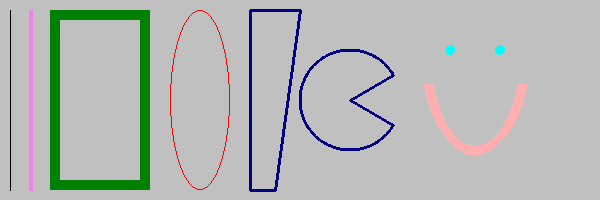
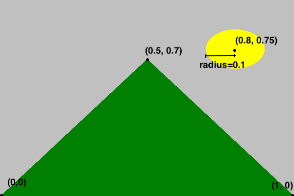

# Introduction to `dudraw`

## What can you do with `dudraw`?
The python package `dudraw` is a minimal graphics library developed for teaching a beginning python programming class. Its starting point was `stddraw`, developed at Princeton University (see [Elements of Programming in Python](https://introcs.cs.princeton.edu/python/code/index.php#programs)). At the University of Denver we modified and enhanced that package to produce `dudraw`.

The `dudraw` package has graphics primitives for drawing points, lines, circles and ellipses, squares and rectangles, triangles, quadrilaterals, polygons, circular and elliptical sectors, annuli and text. You can set the color you want the objects to be, and the width of points, lines and outlines.

You can find out about key-clicks and mouse presses from the user, and respond to them within your program. You can clear the background or use an image from a file as your background. You can save the image you produce to a file.

The `dudraw` package is a paint-style graphics package. In other words, you draw graphical objects, but they cannot be moved or deleted after being drawn.

## How do I get access to `dudraw`?
If you have not already installed `dudraw` through the instructions in class, then you can install it by running  

`pip install dudraw`

Then if start your python program with the line

`import dudraw`

you will be able to call any of the functions in `dudraw`

## How do I use `dudraw`?

Begin by creating a canvas of a specified size (in pixels), then issue graphics commands. When you are done, call the `show()`function and a window will appear with the image you have created. Unless you set the scale, the default scale is from 0 to 1 on the x-axis and 0 to 1 on the y-axis. Here's a simple program, and the image it produces.

    import dudraw
    # open a square window, parameters are width and height, in pixels
    dudraw.set_canvas_size(200,200)
    # fill the canvas with the given color
    dudraw.clear(dudraw.LIGHT_GRAY)
    # once the pen color is set, that is the color used until it is changed again
    dudraw.set_pen_color(dudraw.DARK_GREEN)
    # draw a triangle with vertices (0, 0), (1, 0) and (0.5, 0.7)
    dudraw.filled_triangle(0, 0, 1, 0, 0.5, 0.7)
    dudraw.set_pen_color(dudraw.YELLOW)
    # Draw a circle with center at (0.8, 0.75), with a radius of 0.1
    dudraw.filled_circle(0.8, 0.75, 0.1)
    dudraw.show()

## How do I get more colors?
This is a list of the colors pre-defined in dudraw:

     dudraw.WHITE
     dudraw.BLACK
     dudraw.RED
     dudraw.GREEN
     dudraw.BLUE
     dudraw.CYAN
     dudraw.MAGENTA
     dudraw.YELLOW
     dudraw.DARK_RED
     dudraw.DARK_GREEN
     dudraw.DARK_BLUE
     dudraw.GRAY
     dudraw.LIGHT_GRAY
     dudraw.ORANGE
     dudraw.VIOLET
     dudraw.PINK
     dudraw.BOOK_BLUE
     dudraw.BOOK_LIGHT_BLUE
     dudraw.BOOK_RED

To create colors of your own, first note that a color on a computer monitor can be defined by an intensity for red light, green light and blue light, each of which is an integer value from 0 to 255. Colors on a compter monitor are additive like light, rather than subtractive like paint. For example, to create yellow light, you add together green light and red light. So the brightest yellow is defined by red=255, green = 255, blue = 0. You can play around with choosing colors with many different programs. On many browsers, if you do an internet search on "color picker" one will show up. Or there are many free ones available on websites, for example here: [color picker website](https://htmlcolorcodes.com/color-picker/).
For example, here's a nice plum color, with values r = 140, g = 40, b = 160:

Here's a way to make your background this color, or to set your pen color to this color:

    dudraw.clear_rgb(140, 40, 160)
    dudraw.set_pen_color_rgb(140, 40,160)

## May I see some other shapes?

The code below shows some examples of lines and basic shapes that are affected by the pen radius.

    #---------------------------------------------
    # demonstration of some basic shapes in dudraw
    #---------------------------------------------
    import dudraw
        # open a 600x200 pixel canvas, and set the scale to one unit per pixel
    dudraw.set_canvas_size(600,200)
    dudraw.set_x_scale(0,600)
    dudraw.set_y_scale(0,200)
    dudraw.clear(dudraw.LIGHT_GRAY)
    # draw a vertical line, from (10,10) to (10,100)
    dudraw.line(10, 10, 10, 190)
    # change the color, and change the width of the pen to 4 units (which is 4 pixels in this example).
    dudraw.set_pen_color(dudraw.VIOLET)
    dudraw.set_pen_width(4)
    dudraw.line(30, 10, 30, 190)
    # make a green rectangle with a thick outline
    dudraw.set_pen_color(dudraw.DARK_GREEN)
    dudraw.set_pen_width(10)
    dudraw.rectangle(100, 100, 50, 90) # center at (100,100), half-width=50, half-height = 90
    # ellipse with thin red outline
    dudraw.set_pen_color(dudraw.RED)
    dudraw.set_pen_width(1)
    dudraw.ellipse(200, 100, 30, 90) # center at (200, 100), half-width = 30, half-height = 90
    # Blue quadrilateral
    dudraw.set_pen_color(dudraw.DARK_BLUE)
    dudraw.set_pen_width(3)
    # The four vertices are (250, 10), (250, 190), (300,190), (275, 10)
    dudraw.quadrilateral(250, 10, 250, 190, 300, 190, 275, 10) 
    # Sector, notice that the color and width were not changed, so the values remain as before
    # The center is at (350, 100). The radius is 50. The last two parameters give the starting and
    # ending angles, in degrees. Angles are measured as typical in mathematics,
    # counter-clockwise starting at the positive x-axis
    dudraw.sector(350, 100, 50, 30, 330)
    # points: size is controlled by the pen width, parameters are just the location of the point
    dudraw.set_pen_color(dudraw.CYAN)
    dudraw.set_pen_width(10)
    dudraw.point(450, 150)
    dudraw.point(500, 150)
    # elliptical arc: give the center point, the radius in the x-direction, the radius in
    #  the y-direction, and the start/stop angles.
    # Angles are measured as typical in mathematics, counter-clockwise starting at the positive x-axis
    dudraw.set_pen_color(dudraw.PINK)
    dudraw.elliptical_arc(475, 150, 50, 100, 200, 340)
    dudraw.show()

These are not the only shapes affected by the pen width setting. Others include `dudraw.circle()`, `dudraw.square()`, `dudraw.polygon()`, `dudraw.triangle()`, `dudraw.arc()`, `dudraw.elliptical_sector()`, and `dudraw.annulus()`.

There are also `dudraw` primitives that produce filled regions rather than outlines, and these are not affected by the pen width. Here's a program with some examples of filled regions.

    #----------------------------------------------------
    # demonstration of some basic filled shapes in dudraw
    #----------------------------------------------------
    import dudraw
    # open a 600x200 pixel canvas, and set the scale to one unit per pixel
    dudraw.set_canvas_size(600,200)
    dudraw.set_x_scale(0,600)
    dudraw.set_y_scale(0,200)
    dudraw.clear(dudraw.LIGHT_GRAY)
    # draw a vertical line, from (10,10) to (10,100)
    dudraw.line(10, 10, 10, 190)
    # change the color, and change the width of the pen to 4 units (which is 4 pixels in this example).
    dudraw.set_pen_color(dudraw.VIOLET)
    dudraw.set_pen_width(4)
    dudraw.line(30, 10, 30, 190)
    # make a green filled rectangle with a thick outline
    dudraw.set_pen_color(dudraw.DARK_GREEN)
    dudraw.filled_rectangle(100, 100, 50, 90) # center at (100,100), half-width=50, half-height = 90
    # red ellipse
    dudraw.set_pen_color(dudraw.RED)
    dudraw.filled_ellipse(200, 100, 30, 90) # center at (200, 100), half-width = 30, half-height = 90
    # filled Blue quadrilateral
    dudraw.set_pen_color(dudraw.DARK_BLUE)
    # The four vertices are (250, 10), (250, 190), (300,190), (275, 10)
    dudraw.filled_quadrilateral(250, 10, 250, 190, 300, 190, 275, 10) 
    # Sector, notice that the color was not changed, this sector is also dark blue.
    # The center is at (350, 100). The radius is 50. The last two parameters give the starting and
    # ending angles, in degrees. Angles are measured as typical in mathematics,
    # counter-clockwise starting at the positive x-axis
    dudraw.filled_sector(350, 100, 50, 30, 330)
    # points: size is controlled by the pen width, parameters are just the location of the point
    # The points are left in this drawing you so can compare to the images of unfilled regions
    dudraw.set_pen_color(dudraw.CYAN)
    dudraw.set_pen_width(10)
    dudraw.point(450, 150)
    dudraw.point(500, 150)
    # filled elliptical sector: give the center point, the radius in the x-direction, the radius in
    #  the y-direction, and the start/stop angles.
    # Angles are measured as typical in mathematics, counter-clockwise starting at the positive x-axis
    dudraw.set_pen_color(dudraw.PINK)
    dudraw.filled_elliptical_sector(475, 150, 50, 100, 200, 340)
    dudraw.show()

These are not the only filled shapes. Other examples include `dudraw.filled_triangle()`, dudraw.`filled_circle()`, `dudraw.filled_polygon()`, and `dudraw.filled_annulus()`.

## How do I change the scale?
By default, the scale in a dudraw canvas is [0, 1] x [0, 1], even if the size of the canvas itself is not square. For example, the code below produces the image shown. (The image is annotated to show the coordinates of a few points)

    import dudraw
    dudraw.set_canvas_size(600,400)
    dudraw.clear(dudraw.LIGHT_GRAY)
    dudraw.set_pen_color(dudraw.DARK_GREEN)
    dudraw.filled_triangle(0, 0, 1, 0, 0.5, 0.7) # green triangle mountain
    dudraw.set_pen_color(dudraw.YELLOW)
    dudraw.filled_circle(0.8, 0.75, 0.1)         # yellow circle sun
    dudraw.show()

But sometimes you might prefer to set the scale to match the pixels, or some other scaling. This is often useful if the canvas is not square. Here's the code to produce a nearly identical drawing, with the scale on the x-axis and y-axis set to be different from each other, and to have one unit be the size of one pixel. The canvas was created with a width of 600 pixels and a height of 400 pixels. The x-scale is set to go from 0 to 600, while the y-scale is set to go from 0 to 400. Notice that each graphics primitive was modified to reflect the change of scale. The image below is annoted to show how the scale on the axes works.

    import dudraw
    dudraw.set_canvas_size(600, 400)
    dudraw.set_x_scale(0, 600)
    dudraw.set_y_scale(0, 400)
    dudraw.clear(dudraw.LIGHT_GRAY)
    dudraw.set_pen_color(dudraw.DARK_GREEN)
    dudraw.filled_triangle(0, 0, 600, 0, 300, 280)  # green triangle mountain
    dudraw.set_pen_color(dudraw.YELLOW)    
    dudraw.filled_circle(480, 300, 40)              # yellow circle sun
    dudraw.show()

When you create a drawing, the first thing you should do is decide on your scale, since that is the basis for all of the numbers in each shape you draw.

## How do I change the font and the size of text?

To change the font, use the method `dudraw.set_font_family("FontName")`.
To change the size of the font, use `dudraw.set_font_size(size)`.
The size is in points. The default font family is Helvetica, and the default size is 12 points Here is demo code and the resulting image:

    import dudraw
    dudraw.set_canvas_size(500,250)
    dudraw.set_font_family("Courier")
    dudraw.set_font_size(40)
    dudraw.text(0.5, .2, "Courier 40 point")
    dudraw.set_font_family("Helvetica")
    dudraw.set_font_size(24)
    dudraw.text(0.5,0.4, "Helvetica 24 point")
    dudraw.set_font_family("Times New Roman")
    dudraw.set_font_size(12)
    dudraw.text(0.5, 0.6, "Times New Roman 12 point")
    dudraw.set_font_family("Arial")
    dudraw.set_font_size(6)
    dudraw.text(0.5, 0.8, "Arial 6 point")
    dudraw.show()

## How do I create an animation?

Animation is usually created with a while loop. The following template shows what usually goes in the body of the while loop:
* clear the background
* redraw the next frame of the animation
* call `dudraw.show(wait_time)`

When you pass a parameter to `dudraw.show()`, the program pauses for the given wait_time, which is a `float` value giving the time in milliseconds.

Here is sample code that animates a circle appearing to move from the lower left corner     of the canvas to the upper right corner:

    # Simple demo program of animation
    # Animate a circle moving diagonally across the canvas
    import dudraw
    # (x, y) is the position of the center of the circle
    x = 0 
    y = 0 
    # animation loop:
    while True:
        # clear the background to prepare for the next frame
        dudraw.clear(dudraw.GRAY)
        # Update circle to the new position.
        x = x + 0.01
        y = y + 0.01
        # Draw circle at curent position, radius is a constant 0.05
        dudraw.filled_circle(x, y, 0.05)
        # Display the next frame, and pause 20 milliseconds
        dudraw.show(20)

## How do I found out if the user clicked the mouse?

There are three `dudraw` methods for handling mouse ineraction
The function `dudraw.mouse_pressed()` returns a boolean, True if the mouse was pressed. It is typically used within an animation loop.
You can find out the position of the mouse (regardless of whether the mouse is pressed) by calling `dudraw.mouse_x()` and `dudraw.mouse_y()`. Each returns a float with the current position of the mouse. The position of the mouse is relative to the scale that has been set. Here's a sample program showing mouse interaction. Each time the mouse is pressed, a small circle on the canvas at the mouse position.

    #--------------------------------
    # demo of mouse presses in dudraw
    #--------------------------------
    import dudraw
    dudraw.set_canvas_size(500,500)
    # animation loop
    while True:
        # when mouse is pressed, draw a circle of radius 0.02 at the mouse location
        if dudraw.mouse_pressed():
            dudraw.filled_circle(dudraw.mouse_x(), dudraw.mouse_y(), 0.02)
        # pause for 200th of a second
        dudraw.show(50)

## How do I find out if the user typed a key?

Polling for a key click typically happens within an animation loop. You must first call `dudraw.has_next_key_typed()`, which returns a boolean indicating whether the user has typed a key (or perhaps more than one). If the method returns `True`, then you can make a call to `dudraw.next_key_typed()`, which will return a string containing the next most-recently entered key. As an example, the following code is a modification of the mouse interaction code, with the added feature of quiting when the 'q' key is typed:

    #-------------------------------------------------
    # demo of mouse presses and key presses in dudraw
    #-------------------------------------------------
    import dudraw
    dudraw.set_canvas_size(500,500)
    done = False
    # animation loop
    while not done:
        # when mouse is pressed, draw a circle of radius 0.02 at the mouse location
        if dudraw.mouse_pressed():
            dudraw.filled_circle(dudraw.mouse_x(), dudraw.mouse_y(), 0.02)
        # pause for 200th of a second
        dudraw.show(50)
        if dudraw.has_next_key_typed() and dudraw.next_key_typed()=='q':
            done = True;

## How do I save my image in a file

   Use the `dudraw.save()` function. You can output either .png files or .jpg files. The extension you use in the file name determines what file type is output.
   Here's an example of a program that draws a very simple picture, and saves the output to two files, one .png and one .jpg:

    #-----------------------------------
    # demo of saving to a file in dudraw
    #-----------------------------------
    import dudraw
    # draw a red circle on a field of white
    dudraw.set_canvas_size(300,300)
    dudraw.set_pen_color(dudraw.RED)
    dudraw.filled_circle(0.5, 0.5, 0.25)
    dudraw.save("red_circle.jpg")
    dudraw.save("red_circle.png")

Notice that this program does not have a call to `dudraw.show()`. This means that, although the image is saved to both files, a window displaying the image is never opened, and the image is not displayed to the screen.

## How do I use an image as a background?

TBD

## How do I get official details on all of the methods

TBD