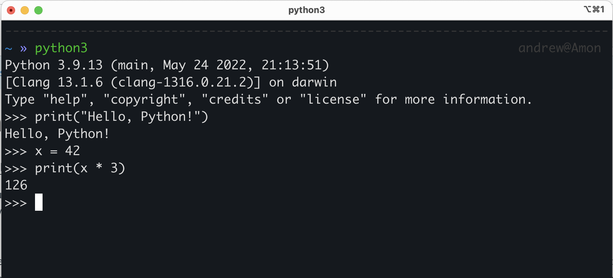
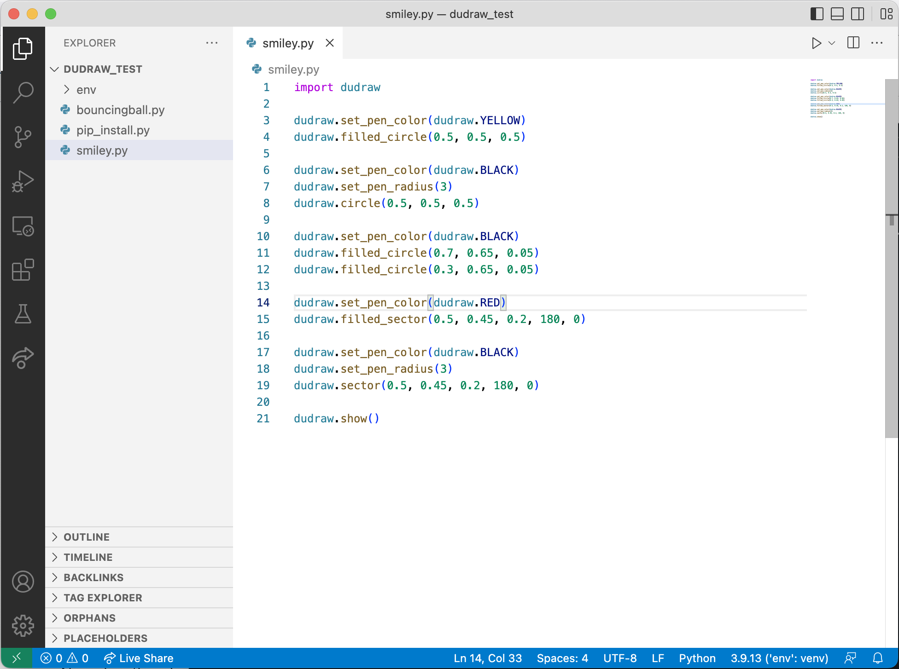
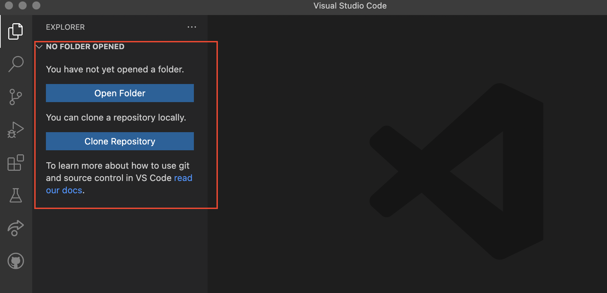
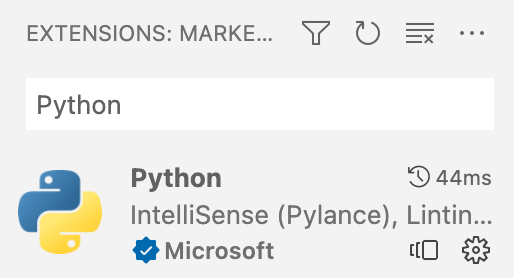
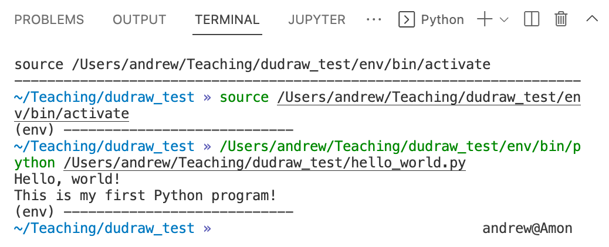

# Installation

## Development Environment

In order to be able to write and execute Python programs, we will have you install two different pieces of software on your computer:

### Python:



This is the Python **_interpreter_** (or Python _executable_). This is the software that will actually read your Python code, and tell the computer how to execute it.

This is usually bundled with an extra piece of software (written in Python!) called '**pip**'. Pip is a package manager that is used to install and manage extra Python packages and libraries. It gives you easy access to more powerful tools that aren't necessarily included with Python from the get-go.

The interpreter is technically the only software you need to write and execute Python programs (and it is the most important!), but to make our lives easier we will also install...

### Visual Studio Code:



This is a code editor called Visual Studio Code (**VSCode**) -- not to be confused with Visual Studio, another Microsoft product.

Any Python program that you write will simply be a text file, but with a filename that ends in "**.py**" (instead of "**.txt**", or "**.doc**" for example). Because of this, you can use any simple text editor to write the code if you want (for example Notepad.exe on Windows, or TextEdit.app on Mac -- but not Microsoft Word!).

Nowadays though, many programmers will use a special text editor that makes writing code easier by adding helpful tools like syntax highlighting, autocomplete suggestions, and executing/debugging programs - all from within the text editor!

VSCode is one of these -- it's just a special text editor with helpful features for working with code. A neat bonus is that, while we will be using it for Python exclusively in this class, VSCode also works with most other popular programming languages!

* Side-note: When enough features are bundled together in a code editor, and especially when that editor is specifically targeted towards one particular programming language, it is often called an IDE (Integrated Development Environment). VSCode is like our IDE in this case, although it doesn't have all the features that a true IDE might have - but that's okay, we won't need them for now.

VSCode will also give us the ability to collaboratively write code together in real-time on separate computers!

* * *

## Python Installation and Setup

Visit the following page to download the latest official Python installer for your operating system:

[https://www.python.org/downloads/](https://www.python.org/downloads/)

The latest Python version will appear as 3.xx.xx, where xx is some version number. 

Once you've downloaded the installer (**.pkg** for MacOS, or **.exe** for Windows) you can run it simply by double-clicking it.

For the most part, the installation process should be self-explanatory and you can just click through without changing any settings, though there is one extra consideration depending on your operating system:

**Windows:**

* When the installation begins, on the first screen you should see a checkbox at the bottom for the option to "**add Python to PATH**". Make sure that box **IS CHECKED** (you DO want to add the Python executable to your system PATH!), before continuing with installation.

**MacOS:**

* After the installation is complete, go to your Applications folder and find the Python folder inside (probably named "Python 3.xx"). The installer program may even have opened this folder for you automatically. Inside that folder there should be a file named "**Update Shell Profile.command**". Double-click on that file to add the Python executable to your system PATH. Some windows may be opened during this process. It's fine to close them.
* You may be asked if you want to move the "Python" Installer to the Trash. You may say yes to this, since the installation is complete.

* * *

## Visual Studio Code Installation and Setup

  
### Download and Install Instructions:

Visit to the following page to download the official VSCode installer (on Windows you can also install it through the Microsoft App Store): [https://code.visualstudio.com/](https://code.visualstudio.com/)

You'll want to download the latest "Stable" build (which should be the default option for the download button). Continue through the default installation (no need to change any settings).

Then follow the instructions based on your operating system:

**Windows:**
* Double click on .exe file, accept the license agreement then click next.
* Leave the default destination location unchanged and click next
* Leave the "Select Start Menu Folder" location unchanged and click Next
* Check "Create a desktop icon", leaving the rest of the selections as-is, and click next.
* Finally, click "Install", and "Finish", and the program will open.

**MacOS:**
* [](https://code.visualstudio.com/) Double-click to unzip, then drag the file "Visual Studio Code" into the "Applications" folder on your mac. You can then drag it again, from the applications folder, to the dock to create a shortcut.

### Setup VSCode:

Once installation is done and before you open VSCode, create a new folder on Desktop or Documents named "COMP1351".

Open VSCode and do the following:

1. Optionally, go through any initial setup that it walks you through (choosing a theme, etc) or skip all of that for now.
2. When VSCode opens you will see the **explorer** pane on the left (see picture below). Click on **Open Folder**  and navigate to your "COMP1351" folder. Depending on where you saved your COMP1351 folder, and your operating system, at this point you might get a security popup asking you if "you trust the author of the files in this folder" so click yes  

3. Create a new text file (File -> New Text File) or by clicking the "new file" button (see picture below). Name the file "hello.py" then press return. A new file will be created as in the picture below. Once you've created the file, you may see a popup in the lower-right corner of VSCode asking if you want to install the "Recommended Python (see "Extension" notes below - you can install them now or in a moment).

4. Copy/paste the following Python code into that text file:
```python
print("Hello world!")  
print("This is my first Python program!")
```    
5. Save that file (File -> Save, or Command-S on a Mac and Control-S on Windows).
6.  Extensions.
    * If you have not already installed them, then install them now.
    * This will probably take you to another window in VSCode showing the extension info.
    * If you didn't get the recommended extensions popup, or have problems starting the installation, you can go to the Extensions tab on the left-hand panel and manually search for the official Microsoft "Python" extension:


    * After you're done installing the Python extension, go back your code by selecting the tab at the top with the filename you chose.
7. In the bottom-right, you should see a part of the info bar that says "Python" and a version number next to it:

Make sure that version number matches the Python version you installed (for example 3.10.6). If it doesn't, click on the version number and then select the Python executable that you installed earlier.
8. You should also now see in the upper-right corner a triangular "play" button. Go ahead and click it to run your Python file!  
  
9. If everything is working, you should see a console come up at the bottom of your window, and at the end of the text in that console you should see the text "Hello world!" and "This is my first Python program!" (probably among other things).


* * *

## Final Setup

If you've gotten this far, congratulations! You have a working Python and VSCode installation! There just two more things to do before you're ready to go for this class:

### Live Share Collaboration:

1. Go to the Extensions tab of VSCode (the icon on the left that looks like a 2x2 grid with a square popped out).
2. From there search for the "Live Share" extension. It will have an official Microsoft check-mark logo attached to it, so you know which one is the correct one.
3. Install it!
4. Now in the bottom-left of your VSCode window, you should see a "Live Share" button. You'll use this later in class to collaboratively write code with your group!

### dudraw Graphics Library:

The `dudraw` graphics library is a software package written at DU, based on the original `stddraw` package written at Princeton. It is a simple package that will allow us to draw images and create animations in our python programs. Here's how to install it:
1. Make a new Python file (File -> New File... -> Python).
2. Copy/paste the following code into the file:
```python
import sys
import subprocess
subprocess.check_call([sys.executable, "-m", "pip", "install", "dudraw"])

import dudraw
dudraw.set_canvas_size(400,400)
dudraw.filled_circle(0.5, 0.5, 0.25)
dudraw.show(10000)
```
3. Save the file somewhere (again, with a ".py" ending, maybe "dudraw_test.py").
4. And then run it (again using the triangular "run" button).
5. If everything goes well, you should see a window appear with a black circle in it. It will close itself after 10 seconds. That's it!

**If something went wrong in any of the steps above, try the videos in the preclass assignment. If those don't help, then please contact your instructor before the first class to get help with setting up.**