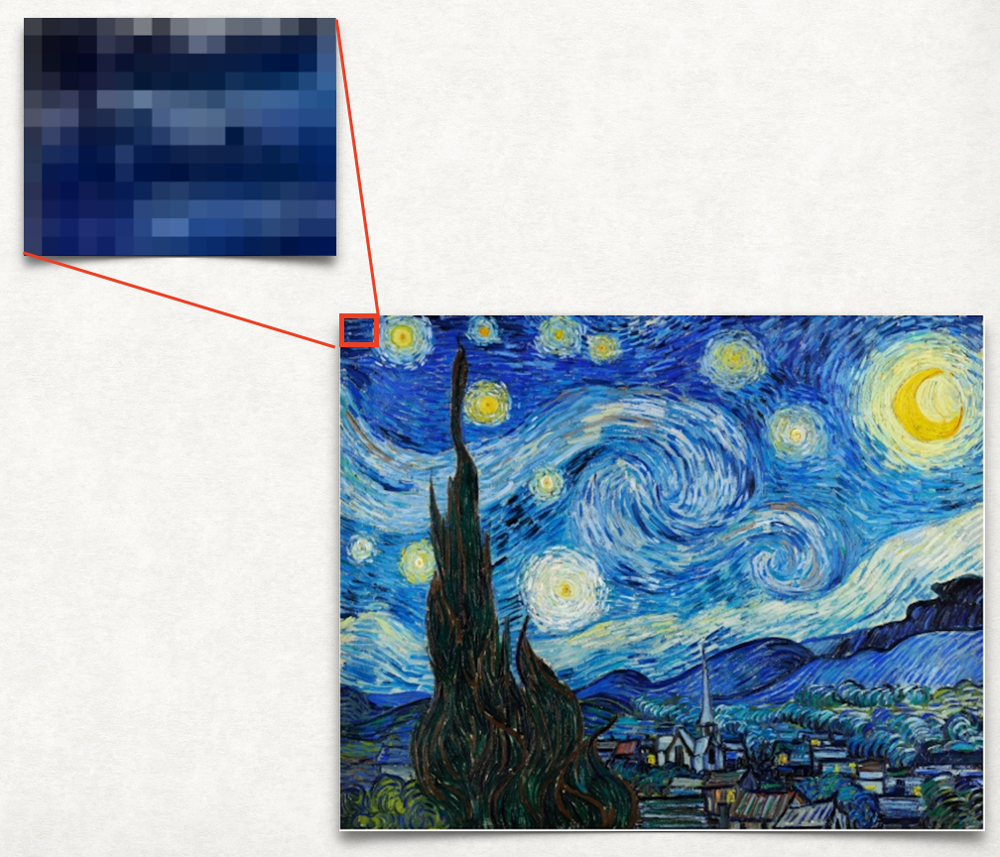
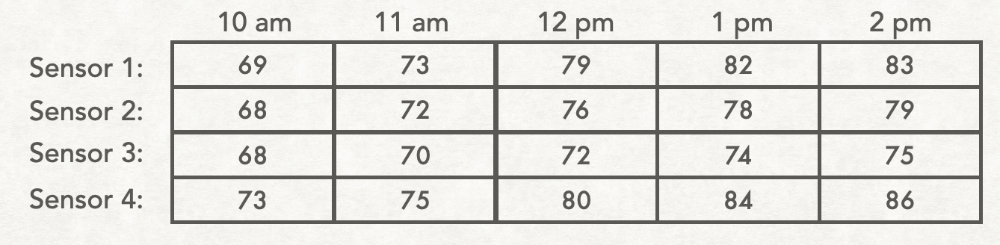

## Why do we need 2D lists?

There are many uses for 2D lists in programming. For example, many games require storage of information in two dimensions.
Writing a computer program in python to implement any of the following games would likely use a 2D list:

<figure>

</figure>

Another example is the storage of digital images, which can be stored as 2D lists. If you zoom in closely on a digital image, you will see that the image is composed of small squares of color called pixels (the word comes from “*pic*ture *el*ements”).
So the image can be stored as a 2D grid of colors. In python this is a 2D list, or a list of lists.

<figure>

</figure>

Third, sometimes information is best organized in a grid. In these cases, the data would be stored in a 2D list. For example, here's a table that stores the temperature recorded by several different sensors at several times of day:
<figure>

</figure>

And here's a table showing the average heating bill for several different apartments during each quarter of the year:

<figure>

</figure>

Next we will look at how 2D lists are stored in python as lists of lists.
