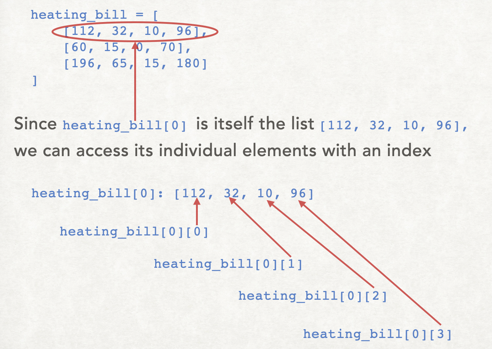

## Defining 2D lists in python

One way to create a 2D list in python is to use a 2D *list literal*. You've already learned how to create a 1D list literal, and the syntax here is similar. However, instead of a simple list, here we have a list of lists, or nested list.

The python code below stores the contents of this table:
<figure>

</figure>

```python
heating_bill = [
    [112, 32, 10, 96],
    [60, 15, 0, 70],
    [196, 65, 15, 180]
```
Notice that `heating_bill` is a list with 3 items. Each item is itself a list. 
- The first element `heating_bill[0]` is itself a list: `[112, 32, 10, 96]`.
- The second element` heating_bill[1]` is itself a list: `[60, 15, 0, 70]`.
- The third element heating_bill[2] is itself a list: `[196, 65, 15, 180]`.

## How to access individual elements in a 2D list

<figure>

</figure>


Rather than focusing on 2D lists as a list of lists, another perspective is to think of it as a rectangular grid, each position having a row position and a column position. So to indicate a specific element, you give two index values. The first index gives the row and the second index gives the column.

For example:

- `heating_bill[0][0]` refers to row index `0`, column index `0`, whose value is `112`.
- `heating_bill[2][3]` refers to row index `2`, column index `3`, whose value is `180`.
- `heating_bill[1][2]` refers to row index `1`, column index `2`, whose value is `0`.

## Creating 2D lists using `for`-loops

Consider the following `4x3` 2D list, with all values initialized to `0`:
```python
temperature = [
    [0, 0, 0],
    [0, 0, 0],
    [0, 0, 0],
    [0, 0, 0]
]
```
This 2D list could be created more flexibly with the following code:
```python
# Create an empty list
temperature = []
# Four rows:
for row in range(4):
    # Create an empty sub-list
    new_row = [] 
    # Fill the row with three 0's   
    for column in range(3):
        new_row.append(0)
    # Put the newly-created row into the outer list:
    temperature.append(new_row)
```