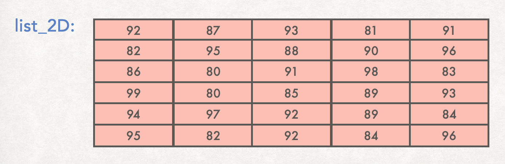

## Two-dimensional lists

Think of a list as a linear storage of multiple values.

<figure>

</figure>

In python you can also have two-dimensional (2D) lists. A 2D list is a matrix or grid of values.

<figure>

</figure>