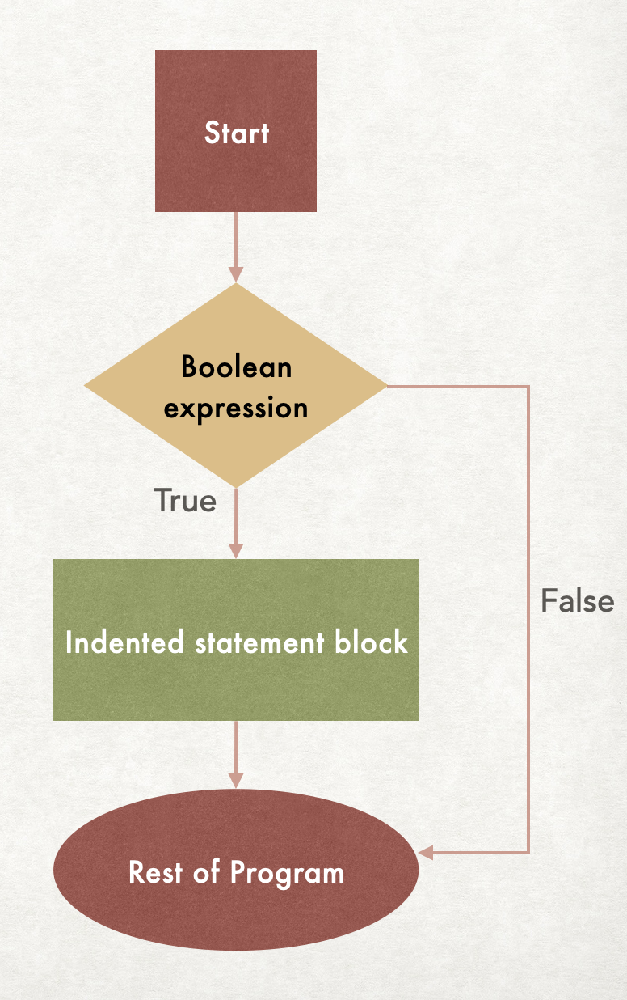
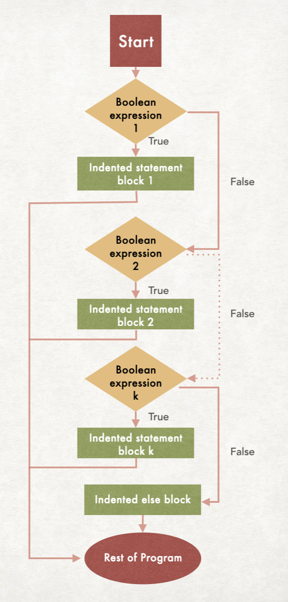

## Conditional statements (also called branch statements)
In python, conditional statements include `if` statements, `if-else` statements, and `if-else` ladders.

## `If` statements
The syntax of an `if` statement is:
```python
if <condition>:
    # Indented statement block
# Rest of program
```
The condition is a boolean expression (in other words, it is `True` or `False`). The indented code block is executed if the condition evaluates to `True`, otherwise it is skipped. So the `if` statement controls whether or not that block of code runs. The indentation is extremely important - the indentation tells python which lines to skip if the condition is `False`.

This flowchart shows visually that the indented block of code is executed if the boolean expression is `True`, and is skipped if the boolean expression is `False`.
<figure>

</figure>

Examples of `if`-statements:
Trace the following code blocks and confirm the outputs.
<table>
<tr>
<td>Code</td><td>Output</td><td>Notes</td>
</tr>
<tr>
<td nowrap>

```python
x=5
y=7
if x>y:
    print("A")
print("B")
```

</td>

<td>

```
B
```
</td>
<td>

`"A"` is not output, since `x>y` is `False`.<br>
But `"B"` is output, since it is not<br>
part of the indented block.
</td>
</tr>
<tr>
<td nowrap>

```python
x=10
y=7
if x>y:
    print("A")
print("B")
```

</td>

<td>

```
A
B
```
</td>
<td>

`"A"` **is** output, since `x>y` is `True`.<br>
And `"B"` is output regardless, since it is<br> 
**not** part of the indented block.
</td>
</tr>
<tr>
<td nowrap>

```python
x=5
y=7
if x>y:
    print("A")
    print("B")
```

</td>

<td>

```

```
</td>
<td>

`"A"` is not output, since `x>y` is `False`.<br>
And this time `"B"` is **also not** output,<br>
since this time it **is** part of the indented block.
</td>
</tr>
</table>

## `If-else` statements

An `if-else` statement gives the program an alternative block of code to execute if the condition in the `if` statement is `False`. The `if-else` statement will execute **one** (and **only one**) of the two code blocks 

The syntax of an `if-else` statement is:
```python
if <condition>:
    # Indented statement block 1
else:
    # Indented statement block 2
# Rest of program
```
The condition is a boolean expression (in other words, it is `True` or `False`). The indented code block 1 is executed if the condition evaluates to `True`, otherwise the indented code block 2 is executed. Thus we control which block of code to execute based on the `True/False` value of the condition.

This flowchart shows visually the path through an `if-else` statement:
<figure>

</figure>


Trace through the following examples of `if-else`-statements, and confirm the outputs.

<table>
<tr>
<td>Code</td><td>Output</td><td>Notes</td>
</tr>
<tr>
<td nowrap>

```python
x=5
y=7
if x>y:
    print("A")
else:
    print("B")
```

</td>

<td>

```
B
```
</td>
<td>

Since `x>y` is `False`, `"A"` is **not** output. <br>
Instead the `else` block is executed, <br>
and **just** `"B"` is output. 
</td>
</tr>
<tr>
<td nowrap>

```python
x=5
y=7
if x<y:
    print("A")
else:
    print("B")
```

</td>

<td>

```
A
```
</td>
<td>

This time `"A"` **is** output, since `x<y` is `True`.<br>
`"B"` is **not** output since it is part of the `else` block.
</td>
</tr>

</table>

Notice that in the above code, only one of `"A"` and `"B"` can be output, since one lies in the `if` block and the other lies in the `else` block. It is not possible for both to be output.

## `If-else` ladder statements

We use an `if-else` ladder if there are more than two options - it allows for multiple branches. It will execute one block for each of many possible outcomes.

Here is the syntax for an `if-else` ladder:

```python
if <condition_1>:
    # Indented statement block 1
elif <condition_2>:
    # Indented statement block 2
elif <condition_3>:
    # Indented statement block 3
...
elif <condition_k>:
    # Indented statement block k
else:
    # Indented statement block
# Rest of program
```

Each of the conditions is a boolean expression (`True` or `False`). If the outcome of one of the conditions is `True`, then the associated indented statement block will get executed. Once that block is executed, the rest of the `if-else` ladder is skipped, so no further conditions are checked. This means that **no more than one** of the blocks will be executed.

Note that the last `else` block is optional. If the `else` block is omitted, and if none of the previous blocks gets executed, then no code at all in the `if-else` ladder will run.

Here is a flowchart for the `if-else` ladder:
<figure>

</figure>

Trace through the following examples of an `if-else` ladder and confirm the output:

<table>
<tr>
<td>Code</td><td>Output</td><td>Notes</td>
</tr>
<tr>
<td nowrap>

```python
x=15

if x > 0 and x < 10:
    print("Low")
elif x >= 10 and x < 20:
    print("Medium")
elif x >= 20 and x < 30:
    print("High")
```

</td>

<td>

```
Medium
```
</td>
<td>

The first condition `x > 0 and x < 10` evaluates to `False`,<br>
so the first code block is skipped and the next condition is checked.

The second condition `x >= 10 and x < 20` evaluates to `True`,<br>
and so `"Medium"` is output.

No further conditions are checked - the rest of the code is skipped.
</td nowrap>
</tr>
<tr>
<td>

```python
x=100

if x > 0 and x < 10:
    print("Low")
elif x >= 10 and x < 20:
    print("Medium")
elif x >= 20 and x < 30:
    print("High")
```

</td>

<td>

```

```
</td>
<td>

The first condition `x > 0 and x < 10` evaluates to `False`,<br>
so the first code block is skipped and the next condition is checked.

The second condition `x >= 10 and x < 20` also evaluates to `False`,<br>
and so the second code block is skipped and the third condition is checked.

The third and final condition `x >= 20 and x < 30` also evaluates to `False`,<br>
and so the third code block is also skipped.

Nothing is output! Notice that the same issue occurs if `x`<br>
is initialized to a value of 0 or less.

This code could benefit from a final `else` block,<br>
so that no possibilities are skipped.
</td>

</tr>
<tr>
<td nowrap>

```python
x=100

if x > 0 and x < 10:
    print("Low")
elif x >= 10 and x < 20:
    print("Medium")
elif x >= 20 and x < 30:
    print("High")
else:
    print("Out of range")
```

</td>

<td>

```
Out of range
```
</td>
<td>

The first condition `x > 0 and x < 10` evaluates to `False`, then the second condition `x >= 10 and x < 20` also evaluates to `False`, and then
the third condition `x >= 20 and x < 30` also evaluates to `False`.

This drops us into the `else` block, and `"Out of range"` is output.
</td>
</tr>


</table>

## Putting it all together

Here's a complete sample program demonstrating `if-else` ladders:

```python
"""
A simple program to demonstrate an if-else ladder
Author: COMP 1351 Instructor
File Name: conditional_demo.py
Course: Comp 1351
Assignment: Preview of conditional statements
Collaborators: 1351 Instructors
Internet Sources: None
"""

"""
What to wear in Colorado based on temperature (integer degrees)
Winter jacket if it is less than 25 degrees
Light to medium coat if it is 25 to 44 degrees
Fleece if it is 45 and above, and less than 65 degrees
No jacket needed above 65 degrees
"""

def main():
    # Find out the temperature:
    temperature = int(input("What is the temperature today? "))
    # Give user clothing recommendation based on temperature:
    if temperature < 25:
        print("You should wear a winter jacket.")
    elif temperature >= 25 and temperature < 45:
        print("You should wear a medium or light coat.")
    elif temperature >= 45 and temperature < 65:
        print("You should wear a fleece.")
    else:
        print("You do not need to wear a jacket.")

# Run the program:
if __name__ == '__main__':
    main()
```

Key points:
- The `else` block guarantees that the program will give output no matter what the user enters.
- The program only accepts integer input. Entering a decimal value will result in a `ValueError`. We will learn later how to respond to errors on user input.
- It's a common student error to create a boolean expression like this: `temperature >= 25 and <= 45`. Both sides of the `and` operator must be fully-formed boolean expressions. So it must say `temperature >= 25 and temperature <= 45`.
- By the time we reach the line `elif temperature >=25 and temperature < 45` we can already be sure that the temperature **is** greater than or equal to 25. For it if were not, then we would have executed the first indented block in the `if`, and skipped the rest of the `if-else` ladder. Thus, a simpler and still correct version of this ladder is:

    ```python
    if temperature < 25:
        print("You should wear a winter jacket.")
    elif temperature < 45:
        print("You should wear a medium or light coat.")
    elif temperature < 65:
        print("You should wear a fleece.")
    else:
        print("You do not need to wear a jacket.")
    ```
