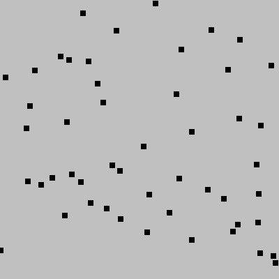

## `for`-loops in python

The `for` loop structure in python is an example of an *iterative* statement. Iterative structures allow you to repeat blocks of code multiple times rather than retyping the lines of code themselves multiple times.

## Syntax of an index-based `for`-loop

To repeat a block of code a specific number of times, we can use the following syntax:

```python
for i in range(<number>):
    # indented block of code
```

Example: output `"Hello, world!"` 5 times, then output `"Done with greetings."`
<table>
<tr><td>Without loops</td>
<td>

With a `for`-loop</td></tr>
<tr>
<td nowrap>

```python
# Awful to have to repeat lines of code!
print("Hello, world!")
print("Hello, world!")
print("Hello, world!")
print("Hello, world!")
print("Hello, world!")
print("Done with greetings.")
```
</td>
<td nowrap>

```python
# Ah, much more efficient!
for i in range(5):
    print("Hello, world!")
print("Done with greetings.")
```
</td>
</tr>
</table>

Key points:
- When programming, we always want to avoid repeating a line or block of code. Not duplicating saves us time when coding. But it also helps us later if we find there is an error or if we decide to make a change. Ideally, we want to make fixes and changes in only one place.
- The indentation is very important. Any lines indented after the `for` line get repeated. When the indentation reverts to the same level as the `for` line, those lines are not repeated, and execute only once.
- The `i` is just the name of a variable. In this kind of `for`-loop designed to simply repeat a block of code a specific number of times, the variable counts which iteration (repeat) we are on. In this situation, it is traditional to call the variable `i`, `j`, or `k`, though technically you may give it any legal variable name.

## The parameter passed to the `range()` function can be a variable.

Example: Ask the user how many greetings they want, then output `"Hello, world!"` that many times, then output `"Done with greetings."`
<table>
<tr><td>Without loops</td>

<td>

With a `for`-loop</td></tr>
<tr>
<td nowrap>

```python
# It's not possible!
```
</td>
<td nowrap>

```python
num_greetings = int(input("How many greetings would you like? "))
for i in range(num_greetings):
    print("Hello, world!")
print("Done with greetings.")
```
</td>
</tr>
</table>


Graphical example: draw 50 small squares at random locations on the screen.

<table>
<tr><td>Code</td><td>Image created</td>
</tr>
<tr>
<td nowrap>

```python
import dudraw
from random import random

# initialize canvas size and clear background
dudraw.set_canvas_size(400,400)
dudraw.clear(dudraw.LIGHT_GRAY)

# Draw a small square at a random 
# (x, y) position, repeat 50 times
for i in range(50):
    x = random()
    y = random()
    dudraw.filled_square(x, y, 0.01)
# display until window is closed:
dudraw.show(float('inf'))
```
<td>

<figure>

</figure>
</td>
</tr>
<tr>
<td nowrap>

```python
# Interesting bug! The (x, y) position
# is randomly chosen *before* the loop.
# So the same values are used every
# time through the loop. The 50 squares
# are all drawn on top of each other
# at the one random location.
dudraw.set_canvas_size(400,400)
dudraw.clear(dudraw.LIGHT_GRAY)
x = random()
y = random()
for i in range(50):
    dudraw.filled_square(x, y, 0.01)
# display until window is closed
dudraw.show(float('inf'))
```
</td>
<td>

<figure>

</figure>
</td>
</tr>

<tr>
<td nowrap>

```python
# Another interesting bug! The
# dudraw.show(forever) command
# is mistakenly indented. So
# only one square is drawn and
# the program never returns from
# the dudraw.show() call
dudraw.set_canvas_size(400,400)
dudraw.clear(dudraw.LIGHT_GRAY)
for i in range(50):
    # The x and y random values are created as
    # parameters within the call to filled_square
    dudraw.filled_square(random(), random(), 0.01)
    # display until window is closed
    dudraw.show(float('inf'))
```
</td>
<td>

<figure>

</figure>
</td>
</tr>
</table>

## Using the loop variable within the body of the loop

In the `for`-statement

```python
for i in range(N):
    # body of loop
```
`range(N)` produces a sequence of integers from `0` through `N-1`, a total of `N` integers. The first time through the loop, he loop variable `i` takes the value `0`,then it takes the value `1` the second time, etc., until in the final iteration of the loop, `i` takes the value `N-1`. Often we make use of the value of `i` itself, since it is effectively counting which iteration of the loop we are currently executing. Note that you can use any legal variable name for the loop variable

Here's a simplest example, with the corresponding output:
<table>
<tr><td>Code</td><td>Output</td></tr>
<tr>
<td nowrap>

```python
print('I know how to count!')
for i in range(5):
    print(i+1)
```
</td>

<td>

```
I know how to count!
1
2
3
4
5
```
</td>
</tr>
</table>

## Variations on the `range()` function

`range(N)` always starts the loop variable at `0` and ends at `N-1`. However, you can specify a different integer start value.

`range(start, stop)` produces a sequence of integers beginning with `start` and ending one less than `stop`. Note that the value for `stop` is never included in the sequence. You can double-check yourself by confirmng that `stop-start` gives the total number of integers in the sequence.

Example: `range(1, 6)` produces the sequence `1, 2, 3, 4, 5`

The `range()` function also allows you to control the step size. This means you can change the sequence so it doesn't increase by `1` from one number to the next.

`range(start, stop, step)`
- start: (optional) is the first value of the sequence
- stop: the sequence stops on the term *before* this value is reached
- step: (optional) integer value giving the increment from one number to the next

Example: `range(3, 10, 2)` produces the sequence `3, 5, 7, 9`.

Example: `range(-2, 13, 3)` produces the sequence `-2, 1, 4, 7, 10`.

Example: `range(10, 7, -1)` produces the sequence `10, 9, 8`.

Example: `range(6, 1, 2)` produces an empty sequence, since the step value is positive, and the start value is greater than the stop value. If this range were used in a `for`-loop, then the loop block would never execute.

