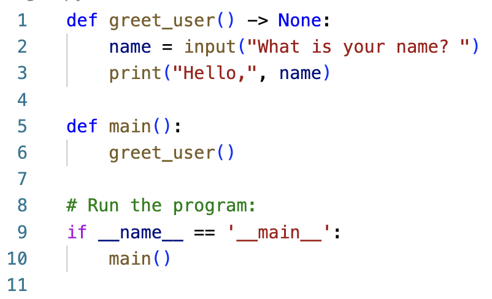
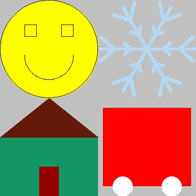

## User-defined functions in python

Most programming languages give you a way to separate a block of code from the main program. This is useful to
- provide organization to your program by chunking it into blocks that perform specific tasks, and
- allow you to reuse a block of code rather than repeat it.

## Creating user-defined functions

This is the syntax for creating a user-defined function:

```python
def function_name() -> None:
    # Code block for the function
```

Key points:
- The keyword `def` signals the beginning of a function definition.
- The empty pair of parentheses `()` indicates that this function does not take any parameters. Function parameters are explained in a later section.
- The `-> None` indicates that the function does not return any values. Function return values are explained in a later section.
- Defining functions is not completely new to you - you have defined the function `main()` in every program you have written.
- When you define a function, note that the code in the function is **not executed**. The code within the function is executed only when you *call* the function.
- Think of the function definition as a recipe, telling python exactly what to do when another part of the program calls the function.
- To *call* a function (i.e., to *run its code*): at the point where you want it to run, write the name of the funtion, with parentheses.

Example:

Here is the definition of a function called `greet_user()`. It asks the user their name, then says hello, using their name:

```python
def greet_user() -> None:
    name = input("What is your name? ")
    print("Hello,", name)
```

In the above code, nothing is executed. The lines of code within the function only get executed when the function is called. Consider the following program that defines and uses (calls) the function `greet_user()`:

<figure>

</figure>

In the above code, lines 1-3 are the *definition* of the `greet_user()` function. Those lines define what you want python to do whenever `greet_user()` is called. On line 6, the `greet_user()` function is called. So when python executes line 6, it puts `main()` on hold, jumps to line 1, and executes the contents of the `greet_user()` function. That's the moment that the user is asked for their name, and the greeting is output. After that completes, the running of the program reverts back to line 6 in `main()` and continues from there.

## Commenting functions

In this course, we will have a standard for commenting every function. After the `def` line, put a block comment explaining the purpose of the function. This special block comment is called a *docstring*. When we learn about parameters and return values, we will add additional information into these docstrings.

Example:
```python
def greet_user() -> None:
    """
    First example of a user-defined function. Ask user for their name, then
    output "Hello, ", followed by their name
    """
    name = input("What is your name? ")
    print("Hello,", name)
```

## Putting it all together

The following code shows a program that defines and uses several functions. Each of these functions defines how to draw a part of the final image. The definition of each function has been collapsed - you can't see the contents. This is actually helpful, because while looking at the program from the highest level, the details are distracting. Notice that in `main()` we can easily see the overall task of the program from the four function calls. If the details of drawing each shape were placed into one long `main()` function, the higher-level organization of the program would be lost, mired in the details. This demonstrates the importance of using functions to break down code into bite-sized chunks.

<table>
<tr>
<td>Code</td><td>Image produced</td>
</tr>
<tr>
<td>

<figure>

</figure>

</td>

<td>

<figure>

</figure>
</td>

</tr>
</table>


