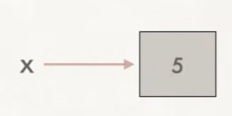
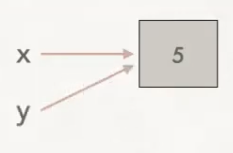
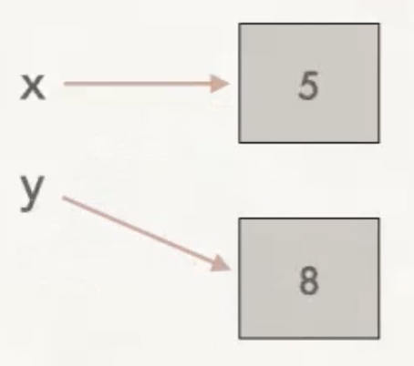
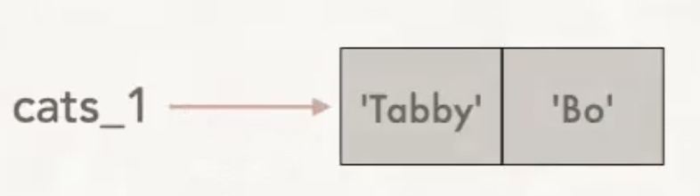
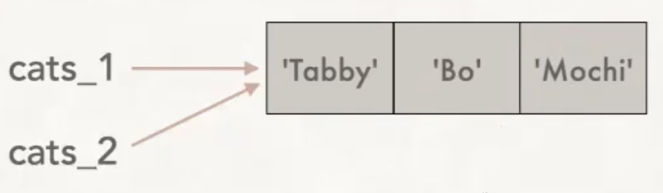
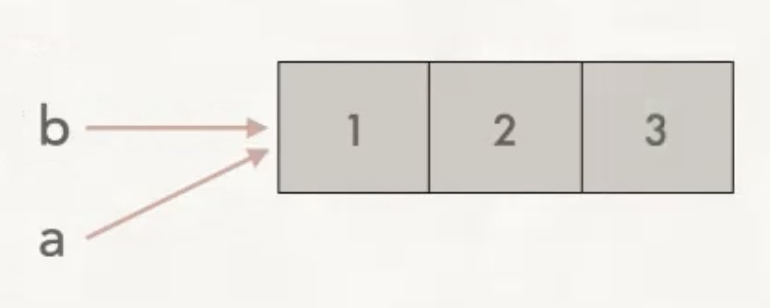
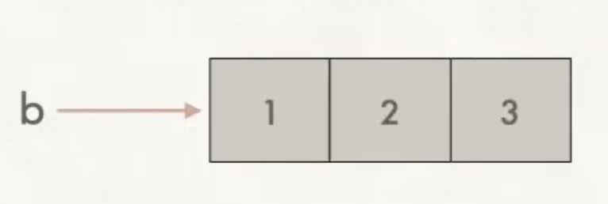
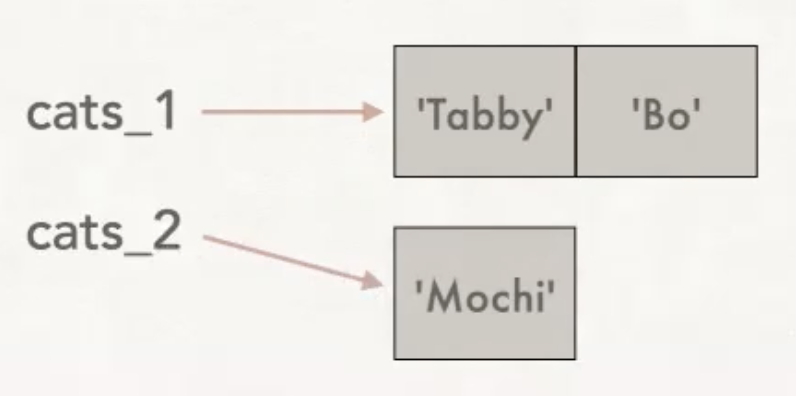

## Immutable versus mutable types

The types `str`, `float`, `int`, `bool` are all immutable. The `list` type is the first type you have seen that is mutable.

The value of an *immutable* type cannot be changed. This may sound wrong to you, since you have been changing the values of variables since the first day of programming. However, in python when we assign a value to a variable, we are technically not changing the value. Instead we are actually assigning to the variable a new value with a new memory address. The old value in its old memory address is not changed - it just becomes irrelevant to this variable. Each snippet of code below is accompanied by a memory diagram that shows what is happening behind the scenes:

<table>

<tr><td>Code</td><td>Memory diagram</td>
</tr>

<tr>
<td nowrap>

```python
x = 5
```
</td>

<td>

<figure>

</figure>

</td>

</tr>

<tr>
<td nowrap>

```python
x = 5
y = x 

# Note that the following code has 
# the identical memory diagram
# x = 5
# y = 5 
```
</td>

<td>

<figure>

</figure>

</td>

</tr>

<tr>
<td nowrap>

```python
x = 5
y = x
y += 3
```
</td>

<td>

<figure>

</figure>

</td>

</tr>

</table>

In the last example above, if we output the contents of `x` and `y`, the values will be different. With immutable types, changing the value of one variable will not change the value that another variable refers to.

On the other hand, the contents of mutable types like `list` can change. This means that if you have more than one variable assigned to the same list, any of those variables can modify the list. And any changes made are visible regardless of which variable accesses the list afterwards. For example:

<table>
<tr><td>Code</td><td>Memory diagram</td>
</tr>

<tr>
<td nowrap>

```python
cats_1 = ['Tabby', 'Bo']
```
</td>

<td>

<figure>

</figure>

</td>

</tr>

<tr>
<tr>
<td nowrap>

```python
cats_1 = ['Tabby', 'Bo']
cats_2 = cats_1
```
</td>

<td>

<figure>

</figure>

</td>

</tr>

<tr>
<td nowrap>

```python
cats_1 = ['Tabby', 'Bo']
cats_2 = cats_1
cats_2.append('Mochi')
```
</td>

<td>

<figure>

</figure>

</td>

</tr>

</table>

Here, if we output `cats_1` and `cats_2`, the contents are *the same*, both are `['Tabby', 'Bo', 'Mochi']`. The list itself has changed, and this change is the reflected in any variable that refers to the same mutable list. It's important to stay aware of which types are mutable and which types are immutable. Without that, you may have unintentional side-effects to your variables that cause bugs.

## Mutable types and functions

When lists are passed to functions, the same mutable behavior applies.  For example, trace the following code by hand starting in `main()`.

```python
def foo(a: list[int])->None:
    a.append(3)

def main():
    b = [1, 2]
    foo(b)
    print(b)
```

The function `foo()` is called, and the list `b` is passed to it. Within `foo()`, the list `a` refers to the same memory location as does the variable `b` from `main()`. In other words, there is only one list, and both `b` and `a` have access to it. Here is the memory diagram immediately after the value `3` is appended to the list:

<figure>

</figure>

When we exit  the function `foo()` and return to `main()`, the variable `a` ceases to exist. The memory now looks like this:

<figure>

</figure>

The contents of the list `b` have been altered by the function `foo()`. The output is `[1, 2, 3]`.

## Reassigning a new list to a variable

The following shows a slightly different situation, in which we reassign a new list to a variable. In this case, we have made the two variables point to *two different lists*. So here, changing one list does not modify the other.

```python
cats_1 = ['Tabby', 'Bo']
cats_2 = cats_1
cats_2 = ['Mochi']
```

Here's the memory diagram at the end of execution of the above code block:

<figure>

</figure>

In this situation, changes to the contents of either list will not alter the list that the other variable refers to.
