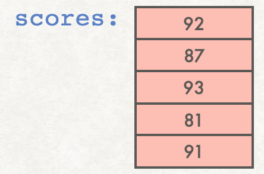

## Python lists
Lists are a built-in data structure in python. Lists are used to store multiple values that are accessed with a single variable name. 

Typically the values stored in a list are all of the same type, though python does allow for different types to be stored within the same list.

## Creating lists

One way to create a list is to use a *list literal*. For example, instead of creating five separate variables to store 5 quiz scores, we can assign them to a list variable by putting the comma-separated values within square brackets, like this:

```python
scores = [92, 87, 93, 81, 91]
```

Here is a visual model for how to think of a list and its contents:


Some people prefer to visualize a list and its contents vertically:



In practice list literals are not the most common way to create lists, since it is not often that we know in advance the exact contents of a list. Another way to create a list is to start with an empty list, then use the list `append()` method to add elements to the end of the list. For example:
```python
scores = []
scores.append(92)
scores.append(87)
scores.append(93)
scores.append(81)
scores.append(91)
```

Here's a more realistic example that uses the `append()` method, taking the values from the user:
```python
scores = [ ]
for i in range(5):
    next_score = int(input('Enter score: '))
    scores.append(next_score)
```

## Accessing elements of a list

A list is an ordered sequence of variables. The positions are numbered starting at `0`. We call the position number an *index*. Put the index in square brackets next to the variable name to access the value stored at that position.

For example, the line of code
```python
print(scores[3])
```
will output `81` to the console. Note that the number `3` in the square brackets refers to the index (the *position*) of a value in the list, while `scores[3]` refers to the *value stored* at that position.

You can visualize the contents together with the index values and the syntax to access the contents like this:


Lists are *mutable* (changeable), so we can modify the contents of a list using an index. For example,
```python
scores[3] = 85
```
will change the value stored at index `3` from an `81` to an `85`. Note: accessing or modifying a list element using an invalid index results in an `IndexError`.

## Tools for working with lists
The line
```python
print(scores)
```
will output all contents of the list to the console, separated by commas and surrounded by square brackets:
```
[92, 87, 93, 81, 91]
```

The `len()` function returns the number of items currently stored in the list. For the above example, `len(scores)` returns `5`.

Valid index values go from `0` to `len(your_list)-1`. The first value stored in a list is `list_name[0]` and the last value is `list_name[len(list_name)-1]`.

## Traversing lists using loops: index-based versus content-based loops

First let's create a list. The code below demonstrates getting input from the user and storing it in a list:
```python
# Simple loop getting input from the user and storing it into a list
# Start by creating an empty list called names
names = []
# Get the name of the first friend
friend = input('Input names of your friends. Enter "done" to terminate :' )
# Keep getting names until they enter "done"
while friend != 'done':
    names.append(friend)
    friend = input('Next name: ')

# Output all of the names entered:
print(names)
```

Now let's see two ways to traverse a list and examine every element. We will refer to the first method below as an *index-based loop*. An index-based loop is just a `for`-loop in which the loop variable will iterate over all possible index values in the list. The code below outputs the names of all of the elements in the list `names` using an index-based loop:

```python
print("The names of your friends are:")
# Traverse the list by accessing the contents at each possible index
# The valid index values in the list go from 0 through len(list)-1:
for i in range(len(names)):
    print(names[i])
```

A possible output from the above code is:
```
The names of your friends are:
Phoebe
Rachel
Monica
```

Python offers a second type of `for`-loop to traverse a list, which we will refer to as a *content-based loop*. Not all higher-level languages have this feature. The idea is to iterate over the contents of the list without having to access them using the index. Here is a sample code snippet that implements a content-based loop:

```python
print("The names of your friends are:")
# Traverse the list by accessing each of the values it stores
for friend in names:
    print(friend)
```
In the above code, the variable `friend` traverses through the *contents* stored in each list position. You do not need to worry about index values in this style of loop. The variable `friend` will automatically iterate over each of the values stored in the list.

A possible output from the above code is:
```
The names of your friends are:
Ross
Chandler
Joey
```

In the above code, the variable `names` is a list, whose contents might be `["Ross", "Chandler", "Joey"]`, visualized like this:


 Note that in the index-based loop, the loop variable `i` iterates over the index values, so it takes the values `0`, `1` and `2`. In the content-based loop, on the other hand, the loop variable `friend` iterates over the contents of the list, and takes the values "Ross", "Chandler", "Joey". Finally, notice that in the index-based loop, we access the value stored in the list with `names[i]`, whereas in the content-based loop, the loop variable `friends` itself already contains the value stored in the list.

 ## Negative index values

 In python, you can use negative index values as a way of accessing list elements starting at the end. The last element of a list always has index `len(list_name)-1`. But in python, you can alternately refer to the last element as index `-1`. The second to last element can be referred to with index `-2`, and so on. This diagram shows an example of this:

 

 In the above example, note that `scores[-1]` evaluates to `91`, and `scores[-2]` evaluates to `81`.
 The expressions `scores[-1]` and `scores[len(scores)-1]` refer to the same location in memory. Similarly, `scores[-2]` and `scores[3]` also refer to the same location in memory.
list_name[::-1]`
 ## Slicing lists

 Slicing gives a way to extract a sublist from a list. By putting a start index and a stop index separated by a colon in square brackets, we create a new list that includes the contents at those index values. A typical slice is of the form `list_name[start_index, stop_index]`. Note that the stop index itself is not included in the slice. For example, from the list shown above, the expression `scores[0:3]` result in the list `[92, 87, 93]`, built from the values stored at indices `0, 1, 2`. If the start index is omitted, the start index is assumed to be `0`. For example, `scores[:3]` is the same slice as `scores[0:3]`.

 The slice `scores[1:5]` might look confusing at first, since the list is too short to have an index `5`. However, recall that the stop index of a slice is not itself included in the sublist, so the index values used are `1, 2, 3, 4`, to produce the sublist `[87, 93, 81, 91]`. If you omit the stop index, its default is `len(your_list)`, meaning that the slice goes to the end of the list, including its last element. Thus `scores[1:5]` in this example is equivalent to `scores[1:]`

 A slice can be used to extract a range from a list while skipping elements. More generally, `list_name[start_index, stop_index, step]` begins at `start_index`, ends before reaching `stop_index`, and uses `step` to increment the index count. For example, in the list shown above, the slice `scores[0:5:2]` starts at index `0`, increasing the index by `2` at each step, and ending before index `5`. So the index values `0, 2, 4` are used and the list generated is `[92, 93, 91]`.

 Negative values can be used for the `step`, allowing us to traverse backwards through the list. For example, in the list shown above, the slice `scores[4:0:-2]` uses the index values `4, 2` and produces the list `[91, 93]`. Note that the index `0` element is not included. To include it, use `scores[4::-2]` to produce the list `[93, 91, 92]`.

 A special case can be used to produce a list in reverse order, using `list_name[::-1]`.

## List membership

You can determine whether a value is in a list or not using the `in` and `not in` operators. For example 
- `93 in scores` evalutes to `True`, since `93` is the value stored in `scores[2]`. 
- On the other hand, `93 not in scores` evaluates to `False`. 
- `20 in scores` evaluates to `False`, since none of the values in the list equal `20`.
- On the other hand, `20  not in scores` evalutes to `True`.

## Choosing random elements from a list

If you want to choose a random element from an existing list, one option is to choose a random integer as the index value, ranging from `0` to `len(your_list)-1`. Then that random index can be used to access the list. For example, here we output a random element from the list `["eenie", "meenie", "miney", "mo"]`

```python
import random
words = ["eenie", "meenie", "miney", "mo"]
# produce a random integer from 0 to the last index, len(words)-1
# (recall that randint includes its upper limit)
index = random.randint(0, len(words)-1)
print(words[index])
```

However, there is an easier way to generate a random element from a list. The `random` package has a function called `choice()` that can take a list as a parameter, and will return a randomly-chosen element from the list. You don't have to worry about index values - the `random.choice()` function does that for you. Here's an example of its use:

```python
import random
words = ["eenie", "meenie", "miney", "mo"]
# produces a random integer from 0 to the last index, len(words)-1
print(random.choice(words))
```

## Putting it all together

Here's sample code showing defining a list, accessing a list, modifying a list element, list slices, and list membership.

<table>
<tr><td>Code</td><td>Output</td>
</tr>
<tr>
<td nowrap style="display:inline-block; width:400px;">

```python
month_names = ['January', 'February', 'March', 'April', 
               'May', 'June', 'July', 'August', 
               'September', 'October',  'November', 'December']

print(month_names) # output the entire list
print(len(month_names)) # should output 12
# Index 0 is the first month, January
print(month_names[0]) # index 0 is the first month
print(month_names[4]) # index 4 is the 5th month
print(month_names[11]) # index 11 is 12th month
print(month_names[-1]) # index -1 means the last month
# Create a new list with first 6 months (index 0, 1, 2, 3, 4, 5)
first_half = month_names[0:6]
print(first_half) # note that this is a list
# Create a new list with the last 6 months (index 6, 7, 8, 9, 10, 11)
second_half = month_names[6:]
print(second_half)
# I'm calling Sept/Oct/Nov autumn, these are index 8, 9, 10
autumn = month_names[8:11]
print(autumn)
# Change the value stored at index 9:
month_names[9] = 'Octobrrr'
print(month_names)
print('December' in autumn) # should be False
print('Triember' not in month_names) # should be True
```
</td>
<td>

```
['January', 'February', 'March', 'April', 'May', 'June', 'July', 'August', 'September', 'October', 'November', 'December']
12
January
May
December
December
['January', 'February', 'March', 'April', 'May', 'June']
['July', 'August', 'September', 'October', 'November', 'December']
['September', 'October', 'November']
['January', 'February', 'March', 'April', 'May', 'June', 'July', 'August', 'September', 'Octobrrr', 'November', 'December']
False
True
```
</td>
</tr>
</table>

## Practicing creating and traversing lists (index-based and content-based loops)

Here is a code snippet showing the creation of a list, and then a content-based traversal through the list, followed by an index-based traversal through the list:

```python
from random import random
# Defining a constant LIST_LENGTH makes for more flexible and clear code
LIST_LENGTH = 6
# Generate a list of 6 random numbers
randos = []
for i in range(LIST_LENGTH):
    randos.append(random())

# content-based loop that iterates over all of the
# previously-generated random numbers, and outputs them
# to 5 decimale places.
# The variable randos is the entire list itself.
# The variable rando takes each value stored in the
# list, one by one as the loop iterates over the list.
for rando in randos:
    print(f"{rando:0.5f}")

# index-based loop that iterates over all of the valid
# index values for the previously-generated list of
# random numbers. The variable i takes the values
# 0, 1, 2, ..., 5
# It's better programming practice to use len(your_list)
# rather than a hard-coded number. The variable i stores
# which element we are on. We output i+1 so that the
# # user sees the counting from 1-6 rather than 0-5.
# The expression randos[i] gives the value
# of the random number stored at that index in the list.
for i in range(len(randos)):
    print(f"random number {i+1}: {randos[i]:0.5f}")
```

A possible output is:
```
0.05184
0.17759
0.30319
0.83254
0.61733
0.75492
random number 1: 0.05184
random number 2: 0.17759
random number 3: 0.30319
random number 4: 0.83254
random number 5: 0.61733
random number 6: 0.75492
```

