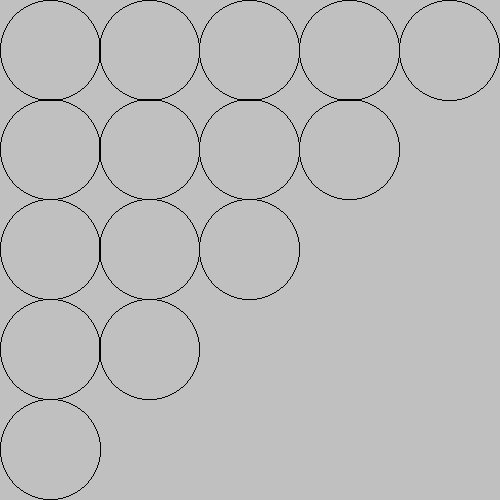
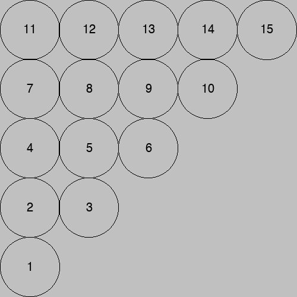

<style>
    .code-and-image {
        display: flex;
        flex-wrap: wrap;
        justify-content: center;
        border: 1px solid whitesmoke;
        padding: 5px;
    }

    .code-and-image pre {
        min-width: 70%;
        max-width: 440px;
        flex-grow: 1;
    }

    .code-and-image img {
        max-width: 30%;
        box-sizing: border-box;
        padding: 7px;
        align-self: center;
    }
</style>
## A first example of a nested `for`-loop

Imagine that you want to produce the following output to the console:
```
*****
*****
*****
*****
*****
*****
*****
```
While the following simple solution works:
```python
print("*****")
print("*****")
print("*****")
print("*****")
print("*****")
print("*****")
print("*****")
```
it is disappointing because of its inflexibility. If we want to change the number of rows and columns depending on user input, the above strategy won't work.

Our first attempt will be to write a flexible code block to output just one line of stars:

```python
# output one row of 5 stars
for j in range(5):
    print("*", end = "")
print()
```
Notice that one `*` is output at a time within the loop, and the newline is suppressed. At the end of the loop, a `print()` statement moves the output to the next line.

Next we need to repeat that block of code 7 times. This is done with a simple `for`-loop, but realize that the block of code within that `for`-loop is itself a `for`-loop. This is how nesting of `for`-loops is a natural solution.
```python
# output 7 rows of 5 stars:
for i in range(7):
    for j in range(5):
        print("*", end = "")
    print()
```
Notice that the inner and outer for loops each have their own variable, and these **must** have different names so that their incrementing does not interfere with each other. Here the outer loop variable is `i` and the inner loop variable is `j`, but of course you are free to name them as you please. Ideally, their names will give us information about their meaning within the program. Note that `j` changes throughout the output of one row, so it identifies which column we are outputting. On the other hand, `i` changes with each new row of our output. So the names given below improve the documentation of the program:

```python
# output 7 rows of 5 stars:
for row in range(7):
    for column in range(5):
        print("*", end = "")
    print()
```

Now that our code is written more generally, we can find out from the user how many rows and columns they want, and remove the hard-coded fixed numbers:
```python
num_rows = int(input("How many rows of stars do you want? "))
num_columns = int(input("How many columns of stars do you want? "))
for row in range(num_rows):
    for column in range(num_columns):
        print("*", end = "")
    print()
```

## Tracing nested `for`-loops

Tracing a nested `for`-loop requires care and patience. It should be done with a piece of paper, writing down updates to the values of every variable. In the previous example, we start by storing the user's values in the variables `num_rows` and `num_columns`. To give a concrete example, let's suppose that `num_rows` is `3` and `num_columns` is `4`. Moving to the outer `for`-loop, we prepare the list of possible values for the variable `row`: `0, 1, 2`. So the variable `row` starts with the value `0`. Now we proceed to the inner `for`-loop block. It is important to realize that this entire loops runs completely through while the value for `row` has the value `0`. The variable `column` will take values in the sequence `0, 1, 2, 3` (since `num_columns` is `4`), and for each of those values, a single `*` will be output. Then finally a newline from the `print()` statement it output, taking us to the next line. This completes the first line of output to the console. We return to the outer `for`-loop, and update the value of `row` to `1`. Then the inner block is repeated, with `column` taking the values `0`, `1`, `2`, then `3`. For each new value of `column`, a `*` is output, resulting in `****`. Again a newline from the `print()` statement takes us to the next line, followed by a return to the outer `for`-loop, where `row` is updated to its final value of `2`. The entire inner for loop is executed again, producing a third line `****` of output. We return to the outer `for`-loop one last time to discover that `row` has stepped through each of its possible values. So the segment of code is complete. Note that the following is the order of the values taken by the variables `row` and `column`:
```
row: 0, column: 0
row: 0, column: 1
row: 0, column: 2
row: 0, column: 3
row: 1, column: 0
row: 1, column: 1
row: 1, column: 2
row: 1, column: 3
row: 2, column: 0
row: 2, column: 1
row: 2, column: 2
row: 2, column: 3
```

## Using the outer loop variable within the inner loop
Suppose we want to output the following pattern to the console:
```
*
**
***
****
*****
```
The loops are similar to what we saw in the previous square grid example, however, this time the number of stars in each row depends on which row we are on. The outer loop variable tells us which row we are on, so we can use this value to control how many stars are output in the inner loop.
```python
# Output 5 rows of stars
for row in range(5):
    # increase the number of stars on each row
    for column in range(row+1):
        print("*", end = "")
    print()
```
In the code above, note that for the iterations of the outer loop, the variable `row` takes the values `0, 1, 2, 3, 4`. But we want `1, 2, 3, 4, 5` stars for each of those rows. Thus we execute the inner `for`-loop `row + 1` times. Alternately, we could have the variable `row` takes the values `1, 2, 3, 4, 5`, so that its value matches the number of stars we want:

```python
# Output 5 rows of stars, the variable row takes the values 1, 2, 3, 4, 5
for row in range(1, 6):
    # The variable row tells us which row we are on, and
    # matches the number of stars needed for that row
    for column in range(row):
        print("*", end = "")
    print()
```


## A graphical example of nested `for`-loops

In this example we will create a drawing with a 5x5 grid of circles. This is most easily done with a nested for loop.

As a first try, see how the following code snippet produces just **one row** of five circles. Within the loop the `x`-position of the center of the circle is updated, so that each time through the loop, the next circle is draw, with its center shifted to the right.

<div class="code-and-image">

```python
# This loop loop steps through the columns, so the
# x position changes, producing 5 circles
for column in range(5):
    dudraw.circle(x_center,  y_center, radius)
    x_center += 2 * radius
```


</div>

To produce a 5x5 grid of circles, we need to repeat the above block of code 5 times. Thus the code above becomes the inner block of a loop, resulting in a nested block of `for` statements. After each row has been completed (i.e., after the inner `for`-loop but inside the outer `for`-loop), we update the `y`-center so that the next row of circles is higher up in the image. We also must reset the `x`-center back to the left side of the image.

<div class="code-and-image">

```python
import dudraw

# We will draw a 5 by 5 grid of circles
# Each circle takes 100 pixels
dudraw.set_canvas_size(500,500)
dudraw.clear(dudraw.LIGHT_GRAY)

# Each circle takes 1/5 of the canvas, and the radius is 1/2 of that
radius = (1/5)/2
# The first circle has its center a distance of one radius from the edge
x_center = radius
y_center = radius

# The outer for-loop steps through each of the *5 rows* 
# of the grid of circles.
for row in range(5):
    # The inner loop steps through the columns, so the
    # x position changes
    for column in range(5):
        dudraw.circle(x_center,  y_center, radius)
        x_center += 2 * radius
    # We are done with drawing this row of circles
    # So reset the x position back to the left side
    x_center = radius
    # and increment the y value so we draw the next row
    y_center += 2 * radius

# display until user closes the window
dudraw.show(float('inf'))
```


</div>

Trace the code carefully, either by hand or by running the debugger, and confirm that an entire row is drawn before moving to the next higher row. This order of drawing the circles is determined because the outer block updates the row number, while the inner block updates the column number. We take this into account in the code by updating the `x_center` within the inner `for`-loop. By restructuring the `for`-loops, the circles can actually be drawn in a different order. The code below draws an entire column (from bottom up) before traversing to the next column. Note that the renaming of the variable is **not** what effected this change. Instead, it was the updating of `y-center` in the middle of the inner `for`-loop. Then, inside the outer loop but outside of the inner loop, the value of `y-center` is reset to the lower edge and `x-center` is increased to move to the next column to the right.
```python
# Each circle takes 1/5 of the canvas, and the radius is 1/2 of that
radius = (1/5)/2
# The first circle has its center a distance of one radius from the edge
x_center = radius
y_center = radius

# The outer for-loop steps through each of the *5 columns* 
# of the grid of circles.
for column in range(5):
    # The inner loop steps through the row within
    # the current column, so the y position changes
    for row in range(5):
        dudraw.circle(x_center,  y_center, radius)
        y_center += 2 * radius
    # We are done with drawing this column of circles
    # So reset the y position back to the bottom and
    y_center = radius
    # increment the x value so we draw the next column
    x_center += 2 * radius
```

## Another strategy for determining the center points

Instead of incrementing the `x-center` and `y-center` variables within the loops to compute the new position of each circle, this position can be determined with a mathematical formula based on the current row and column. Here the values for the center of the circle are computed each time through the loop, and so we do not need to increment them as we traverse the loop.
This strategy has the advantage of a more compact implementation, though some people find the formula for computing the center more difficult.
```python
# Each circle takes 1/5 of the canvas, and the radius is 1/2 of that
diameter = 1/5
radius = diameter/2

# The outer for-loop steps through each of the *5 rows* 
# of the grid of circles.
for row in range(5):
    # The inner loop steps through the columns, so the
    for column in range(5):
        # The x_center and y_center are each computed
        # independently, based on which column and row
        # we are currently drawing. Note that the x-center
        # is determined by the column and the y-center is
        # determined by the row
        x_center = radius + column*diameter
        y_center = radius + row*diameter
        dudraw.circle(x_center,  y_center, radius)
```

## Using the outer loop variable within the inner loop

The image we want to produce shown below on the right is a similar grid of circles, but this time the number of circles varies depending on which row we are on. Notice that the rows are created from bottom to top. The code to produce this image is very similar to the original 5x5 grid of circles. The only difference is that the end point of the inner loop (the `range()` used for the inner `for`-loop), depends on which row we are on. For row 0 we need 1 circle, for row 1 we need 2 circles, for row 2 we need 3 circles, and so on. Thus the number of circles for each row is given by the formula `row + 1`. So the only change to the code is to change the inner `for`-loop to repeat in `range(row + 1)`.

<div class="code-and-image">

```python
import dudraw

# We will draw a 5 by 5 grid of circles
# Each circle takes 100 pixels
dudraw.set_canvas_size(500,500)
dudraw.clear(dudraw.LIGHT_GRAY)

# Each circle takes 1/5 of the canvas, and the radius is 1/2 of that
radius = (1/5)/2
# The first circle has its center a distance of one radius from the edge
x_center = radius
y_center = radius

# The outer for-loop steps through each of the *5 rows* 
# of the grid of circles.
for row in range(5):
    # The inner loop steps through the columns, so the
    # x position changes. The inner loops stops at
    # row + 1, so the number of circles increases
    # at each higher row.
    for column in range(row+1):
        dudraw.circle(x_center,  y_center, radius)
        x_center += 2 * radius
    # We are done with drawing this row of circles
    # So reset the x position back to the left side
    x_center = radius
    # and increment the y value so we draw the next row
    y_center += 2 * radius

# display until user closes the window
dudraw.show(float('inf'))
```



</div>

## The order that the combination of variables are executed
In the code above, the outer loop runs through all possibilities for rows. The name of the variable `row` helps us keep track of this, but notice that the value of that variable is not used within the loop. So you must check that how the values of `x_center` and `y_center` are incremented matches the fact that each iteration of the outer loop outputs an entire row. Tracing through the loop shows that the range values of the pair `row` and `column` occur in the following order:
```
 row: 0, column: 0
 row: 1, column: 0
 row: 1, column: 1
 row: 2, column: 0
 row: 2, column: 1
 row: 2, column: 2
 row: 3, column: 0
 row: 3, column: 1
 row: 3, column: 2
 row: 3, column: 3
 row: 4, column: 0
 row: 4, column: 1
 row: 4, column: 2
 row: 4, column: 3
 row: 4, column: 4
 ```
 The image below shows the order that the corresponding circles are drawn:

 <figure style="margin: 5px auto;">

</figure>
