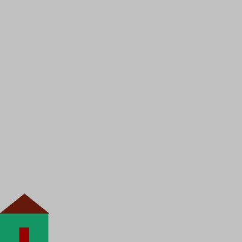
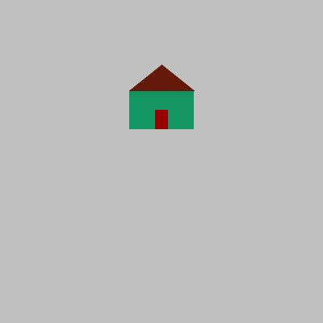
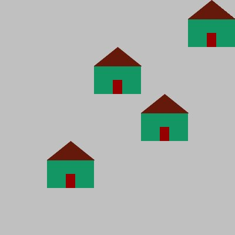

## Creating drawings that you can scale and shift

The code below creates an image of a house that fills a 
[0, 1] x [0, 1] square. The canvas itself is set to a scale of [0, 5] x [0, 5], so the house appears in the lower left corner. Examine the code carefully, since we will modify it to show how to shift and scale each shape in the drawing.

<table>
<tr>
<td>Code for the original drawing</td>
<td>Image</td>
</tr>
<tr>
<td nowrap>

```python
""" Demo showing how to shift an image
    File Name: shifted_house.py
    Author: COMP 1351 instructor
    Date: August 2022
    Course: COMP 1351
    Assignment: Preclass assignment on shifting and scaling
    Collaborators: None
    Internet Source: None
"""
import dudraw

def draw_house() -> None:
    """ Draw a house, fills a [0, 1]x[0, 1] square
        parameters: None
        return: None
    """
    # draw green main body of the house
    dudraw.set_pen_color_rgb(20, 150, 100)
    dudraw.filled_rectangle(0.5, 0.3, 0.5, 0.3)
    # draw brown roof
    dudraw.set_pen_color_rgb(100, 25, 10)
    dudraw.filled_triangle(0, 0.6, 1, 0.6, 0.5, 1)
    # draw red door
    dudraw.set_pen_color_rgb(150, 0, 0)
    dudraw.filled_rectangle(0.5, 0.15, 0.1, 0.15)


def main():
    # On a 400x400 pixel canvas, with a scale from (0,5) to (0,5)
    dudraw.set_canvas_size(400, 400)
    dudraw.set_x_scale(0, 5)
    dudraw.set_y_scale(0, 5)
    # clear the background
    dudraw.clear(dudraw.LIGHT_GRAY)
    # draw a 1x1 unit house in the lower left corner
    draw_house()
    dudraw.show(float('inf'))

# Run the program:
if __name__ == '__main__':
    main()
```
</td>
<td>


<figure>

</figure>

</td>
</tr>

</table>

# Shifting (translating) images

Recall from Algebra that to translate a point in the Cartesian plane to the right or left, we add or subtract from the `x` value, and to translate a point up or down, we add or subtract from the `y` value. We can use this idea to shift our house by modifying all of the `(x, y)` values. Below is the original program, modified so that the image is shifted 2 units to the right and 3 units up. All `x` values have been replaced by `2+x` and all `y` values have been replaced by `3+y`. Notice that only the numbers representing positions have been changed - no values representing sizes have been modified. The image on the right is still 1x1 in size, and still lies in a `[0, 5] x [0, 5]` canvas, but its lower left corner has been translated.

<table>
<tr>
<td>Code for the image shifted by `(2, 3)`</td>
<td>Image</td>
</tr>
<tr>
<td nowrap>

```python
""" Demo showing how to shift an image.
    File Name: shifted_house.py
    Author: COMP 1351 instructor
    Date:
    Course: COMP 1351
    Assignment: Preclass assignment on shifting and scaling
    Collaborators: None
    Internet Source: None
"""
import dudraw

def draw_house() -> None:
    """ Draw a house. The size is 1 by 1, but it is shifted
        to the right 2 and up 3. Thus it fills a 
        [2, 3]x[3, 4] square
        parameters: None
        return: None
    """
    # draw green main body of the house
    dudraw.set_pen_color_rgb(20, 150, 100)
    # shift the (x, y) center, leave the width and height as-is
    dudraw.filled_rectangle(2 + 0.5, 3 + 0.3, 0.5, 0.3)
    # draw brown roof
    dudraw.set_pen_color_rgb(100, 25, 10)
    # the filled_triangle function takes three points as parameters,
    # all of which have to be shifted
    dudraw.filled_triangle(2 + 0, 3 + 0.6, 2 + 1, 
        3 + 0.6, 2 + 0.5, 3 + 1)
    # draw red door
    dudraw.set_pen_color_rgb(150, 0, 0)
    # shift the (x, y) center, leave the width and height as-is
    dudraw.filled_rectangle(2 + 0.5, 3 + 0.15, 0.1, 0.15)


def main():
    # On a 400x400 pixel canvas, with a scale from (0,5) to (0,5)
    dudraw.set_canvas_size(400, 400)
    dudraw.set_x_scale(0, 5)
    dudraw.set_y_scale(0, 5)
    # clear the background
    dudraw.clear(dudraw.LIGHT_GRAY)
    # draw a 1x1 unit house shifted to the point (2, 3)
    draw_house()
    dudraw.save("house.jpg")
    dudraw.show(float('inf'))

# Run the program:
if __name__ == '__main__':
    main()
```
</td>
<td>


<figure>

</figure>

</td>
</tr>

</table>

The above code would be much more flexible if we modified the `draw_house()` function to accept two parameters that give the `x`-shift and `y`-shift of the image. That way we could easily draw several houses, shifted to various locations with very small changes to the code. This strategy is demonstrated below, with multiple houses drawn at various locations. The changes made include
- In the `draw_house()` function, change the shift from `(2, 3)` to generic values of `(x, y)`
- Make the `draw_house()` function accept two parameters `x` and `y` for the generic shift values. These values are both specified to be `float` values.
- In the `main()` function, add several calls to `draw_house(_, _)`, with a variety of values for the shift.

<table>
<tr>
<td>Code for image shifted by variable shift values</td>
<td>Image</td>
</tr>
<tr>
<td nowrap style="display:inline-block; width:400px;">

```python
""" Demo showing how to shift an image.
    The draw_house() function takes two parameters for the
    x-shift and y-shift
    File Name: shifted_house_parameters.py
    Author: COMP 1351 instructor
    Date:
    Course: COMP 1351
    Assignment: Preclass assignment on shifting and scaling
    Collaborators: None
    Internet Source: None
"""
import dudraw

def draw_house(x_shift: float, y_shift: float) -> None:
    """ Draw a house. The size is 1 by 1, but it is shifted
        horizontally by x_shift and vertically by y_shift. Thus it fills a 
        [x_shift, x_shift+1]x[y_shift, y_shift+1] square
        parameters:
            x_shift: left edge of the shifted image (type: float)
            y_shift: bottom edge of the shifted image (type: float)
        return: None
    """
    # draw green main body of the house
    dudraw.set_pen_color_rgb(20, 150, 100)
    # shift the (x, y) center, leave the width and height as-is
    dudraw.filled_rectangle(x_shift + 0.5, y_shift + 0.3, 0.5, 0.3)
    # draw brown roof
    dudraw.set_pen_color_rgb(100, 25, 10)
    # the filled_triangle function takes three points as parameters,
    # all of which have to be shifted
    dudraw.filled_triangle(x_shift + 0, y_shift + 0.6, 
        x_shift + 1, y_shift + 0.6, x_shift + 0.5, y_shift + 1)
    # draw red door
    dudraw.set_pen_color_rgb(150, 0, 0)
    # shift the (x, y) center, leave the width and height as-is
    dudraw.filled_rectangle(x_shift + 0.5, y_shift + 0.15, 0.1, 0.15)


def main():
    # On a 400x400 pixel canvas, with a scale from (0,5) to (0,5)
    dudraw.set_canvas_size(400, 400)
    dudraw.set_x_scale(0, 5)
    dudraw.set_y_scale(0, 5)
    # clear the background
    dudraw.clear(dudraw.LIGHT_GRAY)
    # draw four houses at various locations
    draw_house(2, 3)
    draw_house(1, 1)
    draw_house(4, 4)
    draw_house(3, 2)
    dudraw.save("many_shifted_houses.jpg")
    dudraw.show(float('inf'))

# Run the program:
if __name__ == '__main__':
    main()
```
</td>
<td>


<figure style="margin: 5px auto;">

</figure>

</td>
</tr>

</table>

## Scaling (stretching or compressing) images

This time we will modify the original code so that the image is scaled. If the scale factor is more than 1, then the image is stretched, while a scale factor of less than 1 results in a compression. Recall that to stretch/compress an `x` value, we multiply it by the scale factor. Geometrically, this results in every point being stretched away from the `y`-axis. Similarly, to stretch/compress a `y`-value, we multiply it by our other chosen scale factor, which stretches the point away from the `x`-axis. We can use this idea to change the size of our house. Below is the original program, modified so that the image is stretched a factor of 4 in the `x` direction and a factor of `2` in the `y`-direction. All of `x` values have been replaced by `4*x` and all `y` values have been replaced by `2*y`. Notice that numbers representing sizes (height and width) also must be scaled. The image on the right is now 4x2 in size, and its lower left corner still lies at the origin.

<table>
<tr>
<td>Code for the image scaled 4 horizontally and 2 vertically</td>
<td>Image</td>
</tr>
<tr>
<td nowrap>

```python
""" Demo showing how to scale an image.
    File Name: scaled_house.py
    Author: COMP 1351 instructor
    Date:
    Course: COMP 1351
    Assignment: Preclass assignment on shifting and scaling
    Collaborators: None
    Internet Source: None
"""
import dudraw

def draw_house() -> None:
    """ Draw a house. The size is 4 by 2 with its lower
    corner at (0, 0). Thus it fills a [0, 0]x[4, 2] square
        parameters: None
        return: None
    """
    # draw green main body of the house
    dudraw.set_pen_color_rgb(20, 150, 100)
    # scale the x-positions and sizes by 4 and the
    # y-positions and sizes by 2.
    dudraw.filled_rectangle(4 * 0.5, 2 * 0.3, 4 * 0.5, 2 * 0.3)
    # draw brown roof
    dudraw.set_pen_color_rgb(100, 25, 10)
    # the filled_triangle function takes three points as parameters,
    # all of which have to be scaled
    dudraw.filled_triangle(4 * 0, 2 * 0.6, 4 * 1, 
        2 * 0.6, 4 * 0.5, 2 * 1)
    # draw red door
    dudraw.set_pen_color_rgb(150, 0, 0)
    # scale all x and y values
    dudraw.filled_rectangle(4 * 0.5, 2 * 0.15, 4 * 0.1, 2 * 0.15)


def main():
    # On a 400x400 pixel canvas, with a scale from (0,5) to (0,5)
    dudraw.set_canvas_size(400, 400)
    dudraw.set_x_scale(0, 5)
    dudraw.set_y_scale(0, 5)
    # clear the background
    dudraw.clear(dudraw.LIGHT_GRAY)
    # draw a 4x2 unit house with lower left corner at (0, 0)
    draw_house()
    dudraw.save("scaled_house.jpg")
    dudraw.show(float('inf'))

# Run the program:
if __name__ == '__main__':
    main()
```
</td>
<td>


<figure>

</figure>

</td>
</tr>

</table>

It shouldn't surprise you that our next step will be to modify the `draw_house()` function to accept two parameters for the `x`-scaling factor and the `y`-scaling factor. This makes our function flexible, so that the caller can determine the scaled size. As before, the changes made include
- In the `draw_house()` function, change the scaling from `4` in the `x` direction and `2` in the `y` direction to generic values of  `x_scale` and `y_scale`
- Make the `draw_house()` function accept two parameters `x_scale` and `y_scale` for the generic scaling values. These values are both specified to be `float` values.
- In the `main()` function, add a call to `draw_house(_, _)`, with a chosen values for the size.

<table>
<tr>
<td>Code for the image scaled by variable scaling factors</td>
<td>Image</td>
</tr>
<tr>
<td nowrap>

```python
""" Demo showing how to scale an image.
    File Name: scaled_house_parameter.py
    Author: COMP 1351 instructor
    Date:
    Course: COMP 1351
    Assignment: Preclass assignment on shifting and scaling
    Collaborators: None
    Internet Source: None
"""
import dudraw

def draw_house(x_scale: float, y_scale: float):
    """ Draw a house. The size is x_scale by y_scale, 
        with (0, 0) as the lower left corner.
        [0, x_scale]x[0, y_scale] square
        parameters:
            x_scale: width of the image (type: float)
            y_scale: height edge of the shifted image (type: float)
        return: None
    """
    # draw green main body of the house
    dudraw.set_pen_color_rgb(20, 150, 100)
    # scale the x-positions and sizes by x_scale and the
    # y-positions and sizes by y_scale.
    dudraw.filled_rectangle(x_scale * 0.5, y_scale * 0.3, 
        x_scale * 0.5, y_scale * 0.3)
    # draw brown roof
    dudraw.set_pen_color_rgb(100, 25, 10)
    # the filled_triangle function takes three points as parameters,
    # all of which have to be scaled
    dudraw.filled_triangle(x_scale * 0, y_scale * 0.6, x_scale * 1, 
        y_scale * 0.6, x_scale * 0.5, y_scale * 1)
    # draw red door
    dudraw.set_pen_color_rgb(150, 0, 0)
    # scale all x and y values
    dudraw.filled_rectangle(x_scale * 0.5, y_scale * 0.15, 
        x_scale * 0.1, y_scale * 0.15)


def main():
    # On a 400x400 pixel canvas, with a scale from (0,5) to (0,5)
    dudraw.set_canvas_size(400, 400)
    dudraw.set_x_scale(0, 5)
    dudraw.set_y_scale(0, 5)
    # clear the background
    dudraw.clear(dudraw.LIGHT_GRAY)
    # draw a 2x5 unit house with lower left corner at (0, 0)
    draw_house(2, 5)
    dudraw.save("scaled_house2.jpg")
    dudraw.show(float('inf'))

# Run the program:
if __name__ == '__main__':
    main()
```
</td>
<td>


<figure>

</figure>

</td>
</tr>

</table>

## Putting it all together

In the final example, we modify the code for `draw_house()` to allow for both shift values and scale values to set by the caller. This means our function will have four parameters:
- `x_shift`
- `y_shift`
- `x_scale`
- `y_scale`

Every original `xpos` position will be replaced by `x_shift + x_scale*xpos`

Every original `ypos` position will be replaced by `y_shift + y_scale*ypos`

Every original `x_size` size will be replaced by `x_scale*x_size`

Every original `y_size` size will be replaced by `y_scale*y_size`

Notice that positions are scaled and shifted. Sizes, however, are just scaled and not shifted.

<table>
<tr>
<td>Code for the image scaled by variable scaling factors</td>
<td>Image</td>
</tr>
<tr>
<td nowrap>

```python
""" Demo showing how to scale and shift an image.
    File Name: scaled__shifted_house_parameter.py
    Author: COMP 1351 instructor
    Date:
    Course: COMP 1351
    Assignment: Preclass assignment on shifting and scaling
    Collaborators: None
    Internet Source: None
"""
import dudraw

def draw_house(x_shift: float, y_shift: float, 
               x_scale: float, y_scale: float):
    """ Draw a house. The size is x_scale by y_scale, 
        with (x_shift, y_shift) as the lower left corner.
        It fills a square:
        [x_shift, y_shift+x_scale]x[y_shift, y_shift + y_scale]
        parameters:
            x_shift: left corner of image (type: float)
            y_shift: bottom corner of image (type: float)
            x_scale: width of the image (type: float)
            y_scale: height edge of the shifted image (type: float)
        return: None
    """
    # draw green main body of the house
    dudraw.set_pen_color_rgb(20, 150, 100)
    # scale the x-positions and sizes by x_scale and the
    # y-positions and sizes by y_scale.
    dudraw.filled_rectangle(
        x_shift + x_scale * 0.5, y_shift + y_scale * 0.3, 
        x_scale * 0.5, y_scale * 0.3)
    # draw brown roof
    dudraw.set_pen_color_rgb(100, 25, 10)
    # the filled_triangle function takes three points
    # as parameters, all of which have to be scaled
    dudraw.filled_triangle(
        x_shift + x_scale * 0, y_shift + y_scale * 0.6, 
        x_shift + x_scale * 1, y_shift + y_scale * 0.6, 
        x_shift + x_scale * 0.5, y_shift + y_scale * 1)
    # draw red door
    dudraw.set_pen_color_rgb(150, 0, 0)
    # scale all x and y values
    dudraw.filled_rectangle(
        x_shift + x_scale * 0.5, y_shift + y_scale * 0.15, 
        x_scale * 0.1, y_scale * 0.15)


def main():
    # On a 400x400 pixel canvas, with a scale from (0,1) to (0,1)
    dudraw.set_canvas_size(400, 400)
    dudraw.set_x_scale(0, 1)
    dudraw.set_y_scale(0, 1)
    # clear the background
    dudraw.clear(dudraw.LIGHT_GRAY)
    # draw several houses with various shifts and scaling
    draw_house(0.05, 0.05, 0.45, 0.45)
    draw_house(0.05, 0.75, 0.4, 0.1)
    draw_house(0.75, 0.55, 0.1, 0.4)
    draw_house(0.75, 0.25, 0.1, 0.1)
    dudraw.save("scaled_shifted_house.jpg")
    dudraw.show(float('inf'))

# Run the program:
if __name__ == '__main__':
    main()
```
</td>
<td>


<figure>

</figure>

</td>
</tr>

</table>


