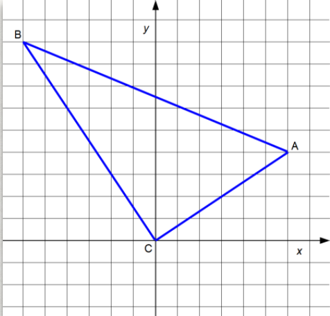
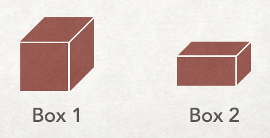
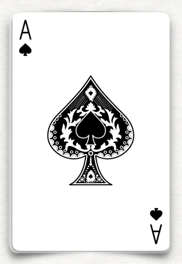
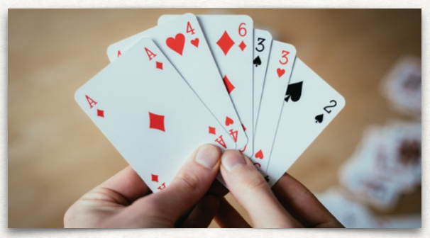

## What is a python `tuple`?

In python, a `tuple` gives a way to tie together two or more values into one container.
You may pronounce it "tupple" or "toople". The idea comes from having an ordered pair of values (a double), or a triple of values, a quadruple, quintuple, etc. You may package as many values together as makes sense for your application.

The elements in a `tuple` may be of the same type, or not. Use a `tuple` when there is some natural underlying concept that ties the values in your `tuple` together - this makes it easier for others to understand your code. The values being put together in the `tuple` should be inextricably connected, and they should be values that we want to access in conjunction.

The syntax is to place the comma-separated values within a pair of parentheses, as in `jane_birthday = (11, 4, 2004)`. Here `(11, 4, 2004)` is a `tuple`.

`Tuple`s are immutable. The values within the `tuple` cannot be changed once the `tuple` has been created.

## Example 1 - coordinates in the x-y plane
An ordered pair gives a location in the x-y plane. So each point in the x-y plane can be stored in a `tuple`.
<table>
<tr><td>Code</td><td>Geometry we are modeling</td></tr>
<tr>
<td>

```python
origin = (0, 0)
vertex_a = (6, 4)
vertex_b = (-6, 9)
vertex_c = origin
```
</td>

<td>

<figure>

</figure>

</td>
</tr>
</table>

## Accessing individual values within a `tuple`

Much like with lists, we can access individual elements within a `tuple` using an index within square brackets. For example, using the tuples defined in the previous example,
```python
print(vertex_b[1])
```
will output `9` (the second coordinate of vertex B).

You can unpack elements from a `tuple` into individual variables:
```python
(b_x, b_y) = vertex_b
```
The value of `b_x` will be `-6` and the value of `b_y` will be `9`.

While you can examine an individual value in a `tuple` using square brackets, note that you *cannot modify individual elements of a `tuple`*, since `tuple`s are immutable.

```python
vertex_b = (-6, 9)
x = vertex_b[0] # valid line of code
vertex_b[0] = -3  # not allowed, since tuples are immutable, crashes with a TypeError
```

## Example 2 - GPS coordinates

GPS locations specify a position on earth. They have two values that represent latitude and longitude. The pair of latitude/longitude values can conveniently be stored in a `tuple`.

```python
du_ecs_building = (39.6743, -104.9615) 
# ECS is 39.6743° N of the equator and 
# 104.9615° W of the prime meridian. 
# The value of du_ecs_building[0] is 39.6743
# The value of du_ecs_building[1] is -104.9615

taj_mahal = (27.1751, 78.0421)
machu_picchu = (-13.1631, 72.5450)
denali_peak = (63.1148, -151.1926)

print(f"The Taj Mahal is located at latitude {taj_mahal[0]}, longitude {taj_mahal[1]}")
```
Output:
```
The Taj Mahal is located at latitude 27.1751, longitude 78.0421
```

## Example 3 - dimensions of a 3D object

A rectangular box has a length, a width, and a height. These dimensions can be stored together in a `tuple`. The code below also demonstrates how to pass a `tuple` to a function, including how to define the type of the parameter. The function can access the individual values within the `tuple`. In `main()` below, two tuples are defined. Then the `volume()` function is called with each of them, and the value is output, rounded to two decimal places.
<table>
<tr>
<td nowrap style="display:inline-block; width:500px;">

```python
def volume(dimensions: tuple[float, float, float])->float:
    return dimensions[0]*dimensions[1]*dimensions[2]

def main():
    box_1 = (2.0, 2.0, 2.0)
    box_2 = (3.0, 0.8, 1)
    # calculate the volume of each box, and 
    # output it to 2 decimal places
    print(f"Box 1 has volume {volume(box_1):.2f}")
    print(f"Box 2 has volume {volume(box_2):.2f}")    
          
main()
```
</td>
<td>

<figure style="margin: 5px auto;">

</figure>
</td>
</tr>
</table>

## Example 4 - playing cards

A playing card represents two pieces of information - the card suit and the card value. These are logically paired together in a `tuple`:

<table>
<tr>

<td>

```python
card  = (“Ace”, “Spades”)
```
</td>
<td>

<figure>

</figure>
</td>
</tr>

<tr>

<td>

```python
hand = [
    (“Ace”, “Diamonds),
    (“4”, “Hearts”),
    (“6”, “Diamonds”),
    (“3”, “Spades”),
    (“3”, “Hearts”),
    (“2”, “Spades”)]
```
</td>
<td>

<figure>

</figure>
</td>
</tr>

</table>

Notice that in this final example we are combining lists and tuples to create a list of tuples. This is called a *compound data structure*. Compound data structures are commonly used and essential in python.

## Putting it all together

The code below contains a function that creates a random playing card. A random element from the list of all possible card suits is chosen, as well as a random element from the list of all possible card values. These are each randomly chosen using the `random.choice()` function. The two are put together into a `tuple`, which is returned to the caller. While it may feel that the function is returning *two* values, in fact it is only returning one: a `tuple` with two elements.

```python
import random

# Here are the constant full lists for all possible card suits
# and all possible card values
SUITS = ["Spades", "Hearts", "Diamonds", "Clubs"]
VALUES = ["Ace", "2", "3", "4", "5", "6", "7", "8", "9", 
          "10", "Jack", "Queen", "King"]

# Create a random card by randomly choosing from the list of all
# possible card suits and all possible card values. Then combine
# into a tuple and return it. Notice the type hinting for the 
# function return type
def random_card()->tuple[str, str]:
    random_suit = random.choice(SUITS)
    random_value = random.choice(VALUES)
    return (random_value, random_suit)

def main():
    # random_card() returns a tuple
    card = random_card()
    print(card) # outputs "(7, diamonds)", for example

main()
```

## Differences and similarities between `tuple` and `list`

In python, `tuple`s and `list`s have these things in common:
- They are ordered.
- You can access individual elements using an index in square brackets
- You can iterate through the individual elements in order (either with an index-based loop or a content-based loop).
- They can be sliced.

But `tuple`s and `list`s differ in the following ways:
- Define a `list` using `[]`, and define a `tuple` using `()`
- `tuple`s are immutable, while `list`s are mutable.
- You can change the value in a list with an assignment like `your_list[2]=4.7`. You can't change individual elements in a tuple, since tuples are immutable.

Use a `list` (and **not** a `tuple`) in this situation:
- Use a `list` when you expect the contents of your data to change while running the program. Tuples are immutable, so once a `tuple` is created, you can neither change the values of the elements nor add/remove elements without creating a new `tuple`.

Use a `tuple` when:
- Use a `tuple` when you *need* your data to be immutable (e.g., we’ll see later that keys for dictionaries must be immutable).
- Use a `tuple` when you want a function to return two values. You can put the two values into a `tuple` and return just the `tuple`.
- If your data is sure not to change during running of the program, using a `tuple` can avoid a bug created by your program accidentally modifying the contents.
- When it’s possible to use either a `list` or a `tuple`, it’s more common to use a `tuple` for heterogenous data types (the elements within the `tuple` are of varying types), and to use a `list` for homogeneous data types (all the elements of the `list` are of the same type).
- It is more efficient (runs faster) to iterate through a `tuple` than a `list`. So if your program is running too slowly, switching to a `tuple` if possible could improve performance.

